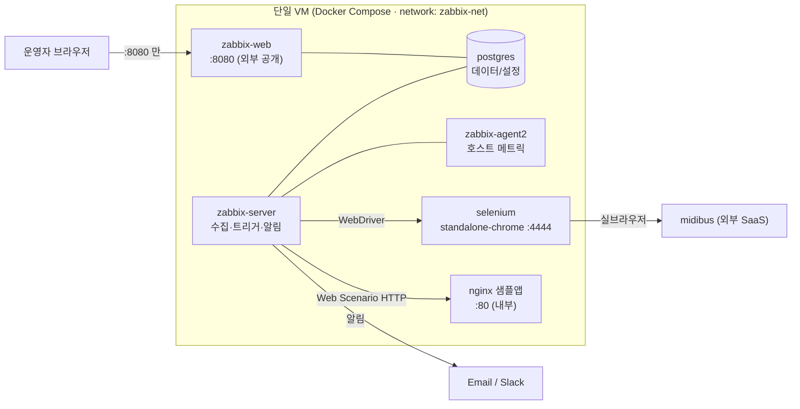

<!--
  이미지 표기 규칙 (초안용 — 실제 스샷 삽입 시 이 마커를 로 교체)
    🖼️ img_XX.png  : private/screenshot/ 에 이미 있는 이미지
    📸 촬영 필요 #N : 아직 없는 이미지 (문서 맨 끝 "촬영 목록" 참고)
-->

# Zabbix E2E 시나리오 기반 웹서비스 가용성 모니터링

Zabbix 7.0 LTS의 **Web Scenario**와 **Browser Item**으로 웹서비스의 E2E 가용성을 모니터링하고, 장애 발생 시 **자동 알림(PROBLEM → RESOLVED)** 을 보내는 단일 Docker Compose 스택입니다.

- **모니터링 대상 ①** nginx 샘플 앱 — HTTP 레벨 다단계 체크(Web Scenario, 3 Step)
- **모니터링 대상 ②** midibus 웹서비스 — 실제 브라우저 시나리오(Browser Item, 5 Step)
- **알림** 이메일 / Slack, 태그 기반 라우팅
- **배포** 단일 VM 위 `docker compose up -d`

---

## 1. 개요

| 항목 | 내용 |
|---|---|
| 목적 | 서버 상태·포트 확인을 넘어 **실제 사용자 시나리오**(접속·로그인·메뉴 이동·데이터 조회)로 서비스 품질을 검증 |
| 대상 | nginx 샘플 앱(Web Scenario) · midibus(Browser Item) |
| 핵심 기술 | Linux, Docker Compose, Zabbix 7.0 LTS, Nginx, Selenium(WebDriver) |
| 배포 | Cloud VM(Ubuntu 24.04) 단일 Docker Compose 스택 |

---

## 2. 아키텍처



**포트 정책** — 외부로 여는 것은 **`8080`(Zabbix Web UI) 하나뿐**입니다. PostgreSQL(5432)·Server(10051)·Agent(10050)·Selenium(4444)·nginx(80)은 모두 내부 브리지(`zabbix-net`)로만 통신합니다. (요구 2.3 "8080 외 외부 차단")

**데이터 흐름** — ① Server가 nginx에 HTTP 요청(Web Scenario) / Selenium을 통해 midibus에 실브라우저 접속(Browser Item) → ② 결과를 PostgreSQL에 저장 → ③ Trigger가 값을 판정(PROBLEM/RESOLVED) → ④ Action이 Email/Slack으로 발송.

---

## 3. 사전 요구사항

| 항목 | 권장 |
|---|---|
| OS | Ubuntu 24.04 LTS (그 외 Linux 가능) |
| Docker Engine | 24.0 이상 |
| Docker Compose | v2 (`docker compose` 서브커맨드) |
| 메모리 | 4 GB 이상 (Selenium/Chrome이 `/dev/shm` 2GB 사용) |
| 네트워크 | 인바운드 `8080/tcp` 개방, 아웃바운드로 midibus 접근 가능 |

```bash
# 버전 확인
docker --version
docker compose version
```

---

## 4. 설치 및 기동

```bash
# 1) 클론
git clone <REPO_URL> zabbix-e2e-monitoring
cd zabbix-e2e-monitoring

# 2) 환경변수 파일 생성 후 값 채우기 (비밀번호는 반드시 강한 값으로)
cp .env.example .env
vi .env        # POSTGRES_PASSWORD 등 변경

# 3) 전체 기동 (단일 명령)
docker compose up -d

# 4) 상태 확인 — 모든 서비스가 running 이어야 함
docker compose ps
```

> 📸 촬영 필요 #1 — `docker compose ps` 출력에서 6개 서비스 전부 `running` 인 화면

`.env` 주요 항목:

| 변수 | 용도 |
|---|---|
| `POSTGRES_USER` / `POSTGRES_PASSWORD` / `POSTGRES_DB` | Zabbix DB 자격증명 |
| `PHP_TZ` | 프론트엔드 타임존(예: `Asia/Seoul`) |
| `ZBX_SERVER_NAME` | UI 상단 설치 이름 |
| `NGINX_SECURE_USER` / `NGINX_SECURE_PASS` | `/secure` Basic Auth(고도화) |

**Web UI 접속** — `http://<VM_IP>:8080`

- 최초 로그인 계정: **`Admin` / `zabbix`** (기본값) → **접속 즉시 비밀번호 변경**하세요.

> 📸 촬영 필요 #2 — Zabbix Web UI 로그인 화면 (선택)

---

## 5. Zabbix 초기 설정 가이드

> Web UI 접속 → (에이전트 인터페이스 조정) → Host 등록 → Web Scenario / Browser Item 등록 순서입니다.

### 5.1 에이전트 인터페이스 조정 (컨테이너 분리 구성 필수)

기본 호스트 "Zabbix server"의 Agent 인터페이스가 `127.0.0.1`이면 별도 컨테이너의 agent에 도달하지 못해 "agent not available" 경고가 뜹니다.

- `Data collection → Hosts → "Zabbix server" → Interfaces → Agent`
- **Connect to: DNS**, **DNS: `zabbix-agent2`**, Port `10050`

(상세: [TROUBLESHOOTING.md](./TROUBLESHOOTING.md) #1)

### 5.2 Host 등록

| Host | Host group | 용도 |
|---|---|---|
| `nginx-sample` | E2E Targets | Web Scenario 대상 |
| `midibus` | E2E Targets | Browser Item 대상 |

> 🖼️ img.png — nginx-sample Host 생성 화면
> 📸 촬영 필요 #3 — midibus Host 화면 (Macros 탭에 `{$MIDIBUS.USER}` / `{$MIDIBUS.PASS}` 가 보이게)

> `midibus` 호스트의 자격증명은 **Secret 매크로** `{$MIDIBUS.USER}` / `{$MIDIBUS.PASS}` 로 분리합니다(스크립트에 하드코딩 금지).

### 5.3 nginx Web Scenario 등록 (3 Step)

`nginx-sample` 호스트 → `Web scenarios` → Create web scenario (`nginx-availability`). Step 3개:

| Step | URL | 검증 |
|---|---|---|
| main | `http://nginx/` | 상태 200 + Required string `Welcome to nginx` |
| health | `http://nginx/health` | 상태 200 + Required string `OK` |
| status | `http://nginx/status` | 상태 200 |

> 📸 촬영 필요 #4 — Web Scenario Steps 탭(3 Step) + 한 Step의 Required status code / Required string 설정 화면

### 5.4 midibus Browser Item 등록 (5 Step)

`midibus` 호스트 → `Items` → Create item.

| 필드 | 값 |
|---|---|
| Type | **Browser** |
| Key | `browser.midibus.e2e` |
| Parameters | `url`, `username` = `{$MIDIBUS.USER}`, `password` = `{$MIDIBUS.PASS}` |
| Script | [`zabbix/midibus-browser-item.js`](./zabbix/midibus-browser-item.js) |
| Update interval | 10m 이상 (미디어 업로드·인코딩 비용 때문에 짧게 두지 않음) |

스크립트는 웹 에디터 붙여넣기 시 손상될 수 있어 **API로 배포**합니다(config-as-code):

```bash
ZBX_PASS='<admin_password>' bash zabbix/update-item-script.sh
```

> **전제** — Browser Item이 동작하려면 compose에 Selenium(WebDriver) + 서버의 `StartBrowserPollers>0` + `WebDriverURL`이 있어야 합니다. 본 스택은 `zabbix-server`에 `ZBX_STARTBROWSERPOLLERS=1`, `ZBX_WEBDRIVERURL=http://selenium:4444` 로 이미 설정되어 있습니다.
>
> **Step 4(보안키) 전제** — "채널에 배포된 영상"이 있어야 보안키를 만들 수 있어, 미리 배포해둔 test 영상(fixture, 채널 `ch_19f2748f`)을 사용합니다.

> 📸 촬영 필요 #5 — Browser Item **설정 화면**(Type=Browser, Parameters, Script 일부, Update interval) — 산출물 5 필수
> 📸 촬영 필요 #6 — Browser Item **실행 결과**(Execute now 후 Latest data의 반환 JSON 또는 History) — 산출물 5 필수

### 5.5 Dependent Item + Trigger

master Browser Item이 반환하는 JSON을 스텝별 숫자 item으로 분해하고(JSONPath), 각 스텝에 트리거를 겁니다.

> 🖼️ img_13.png — midibus dependent items(Latest data)
> 🖼️ img_14.png — midibus 트리거 4종 (`service:midibus` 태그)

(상세 표는 [6. E2E 시나리오 구조](#6-e2e-시나리오-구조) 참고)

### 5.6 알림 (Media type + Action)

- **Media type** — 이메일(Email) 또는 Slack(7.0 내장, bot token). 
- **User media** — 수신 유저에 매체·심각도 지정.
- **Action** — 조건 `Tag service = midibus` → Operations(발송) + **Recovery operations(복구 발송)**.

> 🖼️ img_11.png — Action log(이메일 발송 Sent)
> 📸 촬영 필요 #7 — Slack Media type 설정 화면 / Action 조건·동작 화면 (선택, 산출물 6 보강)

---

## 6. E2E 시나리오 구조

### 6.1 nginx Web Scenario — `nginx-availability`

각 Step은 상태코드·본문·응답시간 중 하나 이상을 검증합니다.

> 🖼️ img_1.png — Web Scenario Latest data (Step별 응답코드 200 / 응답시간 / Failed step 0)

연결 Trigger 3종:

| Trigger | 심각도 | Expression |
|---|---|---|
| Web scenario failed | High | `last(/nginx-sample/web.test.fail[nginx-availability])<>0` |
| Bad HTTP status (main) | High | `last(/nginx-sample/web.test.rspcode[nginx-availability,main])<>200` |
| Response time > 3s (main) | Warning | `last(/nginx-sample/web.test.time[nginx-availability,main,resp])>3` |

> 🖼️ img_2.png — nginx 트리거 3종 (태그 `check:*`, `service:nginx`)

### 6.2 midibus Browser Item — 5 Step

| Step | 동작 | 검증 포인트 |
|---|---|---|
| 1 로그인 | ID/PW 입력 → 로그인 | 계정 드롭다운 노출 |
| 2 카테고리 | 생성 → 채널 자동배포 → 삭제 | 단계별 성공 |
| 3 미디어 | 업로드 → 확인 → 삭제 → 삭제 확인 | 목록 반영 |
| 4 보안키 | 생성(유효시간·허용IP) → 배포URL 적용 → 재생 | 플레이어 재생 |
| 5 보조사용자 | 추가 → 권한 변경 → 삭제 | 목록 권한값 |

반환 JSON의 `steps.*`(0/1)를 Dependent item으로 분해 → 트리거로 판정:

| Dependent item (JSONPath) | Trigger | 심각도 |
|---|---|---|
| `midibus.step.login` (`$.steps.login`) | 로그인 실패 | High |
| `midibus.step.media` (`$.steps.media`) | 미디어 실패 | High |
| `midibus.step.deploy` (`$.steps.deploy`) | 자동배포 실패 | Average |
| `midibus.step.category` (`$.steps.category`) | 카테고리 실패 | Average |

> 트리거 공통: `last(/midibus/<key>)=0` → 실패 시 PROBLEM, 1 복귀 시 자동 RESOLVED. 태그 `service:midibus`.

---

## 7. 장애 테스트 방법

### 7.1 nginx — 컨테이너 중단/재기동

```bash
# 장애 유발: nginx 컨테이너 중단 → Web Scenario 실패
docker stop zbx-nginx-app
```
기대 동작: 다음 폴링에서 `Web scenario failed` 트리거가 **PROBLEM** → Email/Slack 알림 수신.

```bash
# 복구: 재기동
docker start zbx-nginx-app
```
기대 동작: 트리거 **RESOLVED** → 복구 알림 수신.

> 🖼️ img_8.png — `docker stop/start zbx-nginx-app` 실행
> 🖼️ img_3.png / img_4.png — PROBLEM 전환
> 🖼️ img_16.png — Slack 알림 (PROBLEM/RESOLVED) · 🖼️ img_9.png / img_10.png — 이메일 알림
> 🖼️ img_5.png / img_7.png — RESOLVED 전환

### 7.2 nginx — 응답코드 이상 재현

```bash
# /fail 은 의도적으로 500 반환 → rspcode<>200 트리거 검증용
curl -i http://nginx/fail    # (VM 내부 네트워크 기준)
```

### 7.3 midibus — 자격증명 오설정

`{$MIDIBUS.PASS}`를 잠깐 틀린 값으로 바꿔 로그인부터 실패 유발 → 스텝별 트리거 4종 PROBLEM → 값 복원 → RESOLVED.

> 🖼️ img_15.png — midibus 트리거 4종 RESOLVED

---

## 8. 트러블슈팅

전체 기록은 [TROUBLESHOOTING.md](./TROUBLESHOOTING.md). 대표 사례:

- **#1 컨테이너 분리 환경의 "agent not available"** — 인터페이스를 IP가 아닌 서비스명 DNS(`zabbix-agent2`)로.
- **#2 nginx `return` vs `auth_basic`** — `return`은 access 단계(auth)를 건너뛴다 → `alias` 파일 서빙으로 변경.
- **#3 Browser Item 정석 API를 오판** — 대기/alert API는 예제 페이지가 아닌 전용 objects 페이지에 있다.
- **#5 보안키 허용 IP** — 재생 요청 주체는 Selenium(=VM) egress IP이므로 그 IP를 허용해야 통과.

---

## 9. 폴더 구조

```
.
├─ docker-compose.yml            # 전체 스택 (server·web·agent2·postgres·selenium·nginx)
├─ .env.example                  # 환경변수 템플릿 (복사해 .env 생성)
├─ nginx/
│  ├─ conf.d/default.conf        # / · /health · /status (+ /secure · /fail)
│  ├─ html/index.html            # 메인 페이지 (Required String)
│  └─ auth/                      # Basic Auth 자격 (고도화)
├─ zabbix/
│  ├─ midibus-browser-item.js    # Browser Item 5-Step 스크립트
│  └─ update-item-script.sh      # 스크립트를 Zabbix API로 배포
├─ testdata/beach.mp4            # 미디어 업로드 테스트 파일
├─ TROUBLESHOOTING.md
└─ README.md
```

---

## 10. 확장 시도 & 깨달음

요구 스펙 위에서 "무엇을 시도했고 무엇을 깨달았나"를 별도 카탈로그로 정리했습니다(축 A~F: 실행 엔진 / 수집 구조 / 관측 성숙도 / 운영 / 인프라 / 실무 트랙). 핵심 결론은 **"실행은 Playwright, 모니터링은 Zabbix"** 라는 실무 분리 패턴을 직접 부딪히며 확인한 것입니다.

- 상세: `private/docs/interview-and-enhancement-notes.md` · Notion "확장 전략 카탈로그"

---

## 📸 촬영 목록 (한 번에 캡처용)

README 완성을 위해 아래 스크린샷이 필요합니다. (있는 것은 `private/screenshot/`에 이미 존재)

| # | 필요 화면 | 우선도 | 관련 산출물 |
|---|---|---|---|
| 1 | `docker compose ps` — 6개 서비스 전부 running | 높음 | 산출물 2 검증 |
| 2 | Zabbix Web UI 로그인 화면 | 낮음 | — |
| 3 | midibus Host 화면 (Macros `{$MIDIBUS.USER/PASS}`) | 중 | 초기 설정 |
| 4 | nginx Web Scenario 설정 (3 Step + Required status/string) | 높음 | 산출물 4 |
| 5 | midibus Browser Item **설정 화면** | 높음 | 산출물 5 필수 |
| 6 | midibus Browser Item **실행 결과**(Latest data JSON/History) | 높음 | 산출물 5 필수 |
| 7 | Slack Media type / Action 설정 화면 | 낮음 | 산출물 6 보강 |

> 이미 보유: `img.png`(nginx Host), `img_1`(Web Scenario 데이터), `img_2`(nginx 트리거), `img_3~7`(PROBLEM/RESOLVED), `img_8`(docker stop), `img_9~11`(이메일), `img_12~13`(midibus dependent), `img_14`(midibus 트리거), `img_15`(midibus RESOLVED), `img_16`(Slack).
