# Zabbix E2E 시나리오 기반 웹서비스 가용성 모니터링

Zabbix 7.0 LTS의 **Web Scenario**와 **Browser Item**으로 웹서비스의 E2E(End-to-End) 가용성을 감시하고, 장애 발생 시 **자동 알림(PROBLEM → RESOLVED)** 을 보내는 단일 Docker Compose 스택입니다. 서버·포트 확인을 넘어 **접속·로그인·메뉴 이동·데이터 조작**이 실제로 성공하는지를 사용자와 같은 경로로 검증합니다.

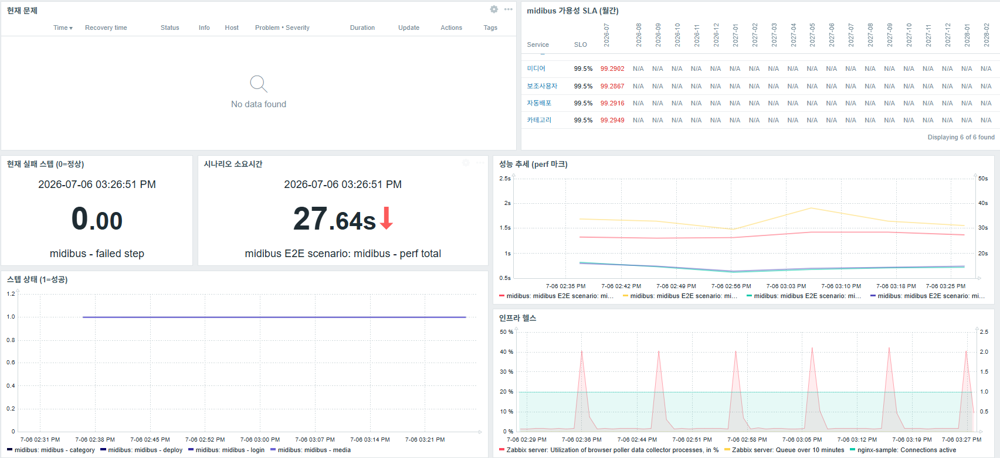

> 한 화면에서 현재 문제 · SLA · 성능 추세 · 인프라 상태를 확인하는 운영 대시보드.

- **감시 대상 ①** nginx 샘플 앱 — HTTP 다단계 체크(Web Scenario, 3 Step)
- **감시 대상 ②** midibus 웹서비스 — 실브라우저 시나리오(Browser Item, 5 Step)
- **알림** Slack / Email, 태그 기반 라우팅, 미확인 시 상향(에스컬레이션)
- **가용성 정량화** Services/SLA로 스텝별 가용성 %(SLO 99.5%)
- **배포** 단일 VM 위 `docker compose up -d`

> 설계 판단과 고도화의 상세 근거는 **[결과보고서](docs/결과보고서.md)** 에 정리했습니다.

---

## 목차

1. [개요](#1-개요)
2. [아키텍처](#2-아키텍처)
3. [사전 요구사항](#3-사전-요구사항)
4. [설치 및 기동](#4-설치-및-기동)
5. [Zabbix 초기 설정 가이드](#5-zabbix-초기-설정-가이드)
6. [E2E 시나리오 구조](#6-e2e-시나리오-구조)
7. [가용성 정량화 (Services / SLA)](#7-가용성-정량화-services--sla)
8. [관측 성숙도 고도화](#8-관측-성숙도-고도화)
9. [알림 및 운영 정비](#9-알림-및-운영-정비)
10. [장애 테스트](#10-장애-테스트)
11. [트러블슈팅](#11-트러블슈팅)
12. [산출물 대응표](#12-산출물-대응표)
13. [저장소 구조](#13-저장소-구조)

---

## 1. 개요

| 항목 | 내용 |
|---|---|
| 목적 | 서버 상태·포트 확인을 넘어 **실제 사용자 시나리오**로 서비스 품질을 검증하고, 장애를 자동 감지·통지 |
| 대상 | nginx 샘플 앱(Web Scenario) · midibus(Browser Item) |
| 핵심 기술 | Linux, Docker Compose, Zabbix 7.0 LTS, Nginx, Selenium(WebDriver) |
| 배포 | Cloud VM(Ubuntu 24.04) 단일 Docker Compose 스택 |

필수 산출물 8종을 모두 저장소에 커밋했으며, 산출물별 위치는 [13. 산출물 대응표](#13-산출물-대응표)에 정리했습니다.

---

## 2. 아키텍처

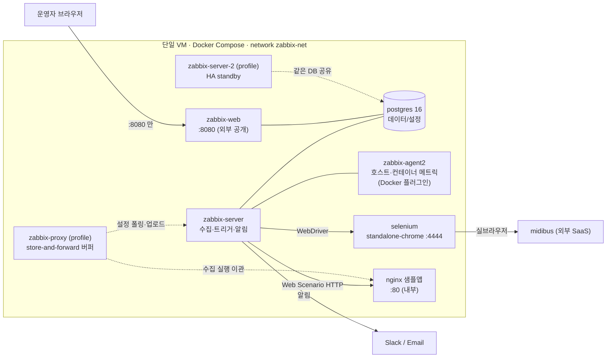

**포트 정책** — 외부로 여는 것은 **`8080`(Zabbix Web UI) 하나뿐**입니다. PostgreSQL(5432)·Server(10051)·Agent(10050)·Selenium(4444)·nginx(80)은 모두 내부 브리지(`zabbix-net`)로만 통신합니다. 점선의 두 서비스(`zabbix-proxy`·`zabbix-server-2`)는 compose **profile**(proxy·ha)로 격리된 이중화 실험 구성으로, 기동해도 외부 노출은 변하지 않습니다([10.5 이중화 실측](#105-이중화-실측--zabbix-proxy--서버-ha) 참고).

**데이터 흐름** — ① Server가 nginx에 HTTP 요청(Web Scenario) / Selenium을 통해 midibus에 실브라우저 접속(Browser Item) → ② 결과를 PostgreSQL에 저장 → ③ Trigger가 판정(PROBLEM/RESOLVED) → ④ Action이 Slack/Email로 발송.

> 각 서비스·설정 키의 판단 근거(예: selenium `shm_size: 2gb`, agent2 Docker 소켓 마운트의 보안 트레이드오프)는 `docker-compose.yml` 주석과 [결과보고서 2장](docs/결과보고서.md)에 기록했습니다.

---

## 3. 사전 요구사항

| 항목 | 권장 |
|---|---|
| OS | Ubuntu 24.04 LTS (그 외 Linux 가능) |
| Docker Engine | 24.0 이상 |
| Docker Compose | v2 (`docker compose` 서브커맨드) |
| 메모리 | 4 GB 이상 (Selenium/Chrome이 `/dev/shm` 2GB 사용) |
| 네트워크 | 인바운드 `8080/tcp` 개방, 아웃바운드로 midibus 접근 가능 |

```bash
docker --version
docker compose version
```

---

## 4. 설치 및 기동

```bash
# 1) 클론
git clone <REPO_URL> zabbix-e2e-monitoring
cd zabbix-e2e-monitoring

# 2) 환경변수 파일 생성 후 값 채우기 (비밀번호는 반드시 강한 값으로)
cp .env.example .env
vi .env        # POSTGRES_PASSWORD 등 변경

# 3) 전체 기동 (단일 명령)
docker compose up -d

# 4) 상태 확인 — 기본 6개 서비스가 running 이어야 함 (proxy/ha 프로파일 서비스 2개는 평시 미기동)
docker compose ps
```

`.env` 주요 항목:

| 변수 | 용도 |
|---|---|
| `POSTGRES_USER` / `POSTGRES_PASSWORD` / `POSTGRES_DB` | Zabbix DB 자격증명 |
| `PHP_TZ` | 프론트엔드 타임존(예: `Asia/Seoul`) |
| `ZBX_SERVER_NAME` | UI 상단 설치 이름 |
| `NGINX_SECURE_USER` / `NGINX_SECURE_PASS` | `/secure` Basic Auth(고도화) |

**Web UI 접속** — `http://<VM_IP>:8080`, 최초 계정 **`Admin` / `zabbix`** → **접속 즉시 비밀번호 변경**.

> `.env`에는 이중화 실험용 knob(히스토리 캐시 통제, HA 노드 식별자, 프록시 노드 나열)도 주석으로 문서화되어 있으며, 값을 넣지 않으면 공식 기본값이 적용되어 검증된 스택이 그대로 동작합니다. 실험 서비스 기동: `docker compose --profile proxy --profile ha up -d`.

---

## 5. Zabbix 초기 설정 가이드

### 5.1 에이전트 인터페이스 조정 (컨테이너 분리 구성 필수)

기본 호스트 "Zabbix server"의 Agent 인터페이스가 `127.0.0.1`이면 별도 컨테이너의 agent에 도달하지 못합니다.
- `Data collection → Hosts → "Zabbix server" → Interfaces → Agent`
- **Connect to: DNS**, **DNS: `zabbix-agent2`**, Port `10050`

(상세: [TROUBLESHOOTING.md](./TROUBLESHOOTING.md) #1)

### 5.2 Host 등록

| Host | Host group | 용도 |
|---|---|---|
| `nginx-sample` | E2E Targets | Web Scenario 대상 |
| `midibus` | E2E Targets | Browser Item 대상 |

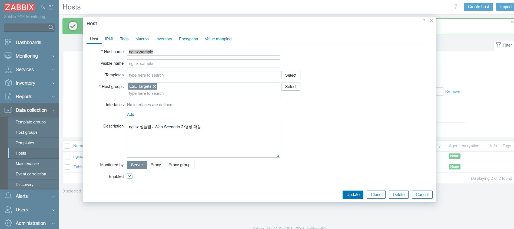

> `midibus` 호스트의 자격증명은 **Secret 매크로** `{$MIDIBUS.USER}` / `{$MIDIBUS.PASS}`, 보안키 허용 IP는 `{$VM.EGRESS_IP}`로 분리합니다(스크립트·export에 하드코딩하지 않습니다).

### 5.3 nginx Web Scenario 등록 (3 Step)

UI 경로: `Data collection → Hosts → nginx-sample 행의 Web → Create web scenario`

| 필드 | 값 | 근거 |
|---|---|---|
| Name | `nginx-availability` | 트리거 키의 시나리오명과 대소문자까지 일치해야 함 |
| Update interval | `1m` | 경량 HTTP 체크 — 빠른 감지 |
| Agent | `other ...` → `Zabbix-Monitor/1.0` | 요구사항 4.1(User-agent 명시). 접근 로그에서 모니터링 트래픽 식별용. API 일괄 적용: `bash zabbix/set-webscenario-agent.sh` |

Steps 탭에서 3단계 등록:

| Step | URL | 검증 |
|---|---|---|
| main | `http://nginx/` | 상태 200 + Required string `Welcome to nginx` |
| health | `http://nginx/health` | 상태 200 + Required string `OK` |
| status | `http://nginx/status` | 상태 200 또는 404 (요구사항 4.2 허용 범위) |

적용 확인 — nginx 접근 로그에 UA가 찍힙니다:

```bash
docker compose logs --since 2m nginx | grep -F 'Zabbix-Monitor/1.0'
# 172.18.x.x [..] "GET / HTTP/1.1" 200 0.000s "Zabbix-Monitor/1.0"
```


### 5.4 midibus Browser Item 등록 (5 Step)

`midibus` 호스트 → Items → Create item.

| 필드 | 값 |
|---|---|
| Type | **Browser** |
| Key | `browser.midibus.e2e` |
| Parameters | `url`, `username`={$MIDIBUS.USER}, `password`={$MIDIBUS.PASS}, `allowed_ip`={$VM.EGRESS_IP} |
| Script | [`zabbix/midibus-browser-item.js`](./zabbix/midibus-browser-item.js) |
| Update interval | 10m 이상 (미디어 업로드·인코딩 비용) |

스크립트는 웹 에디터 붙여넣기 시 손상될 수 있어 **API로 배포**합니다(config-as-code):

```bash
ZBX_PASS='<admin_password>' bash zabbix/update-item-script.sh
```

> **전제** — Browser Item 동작에는 Selenium(WebDriver) + `StartBrowserPollers>0` + `WebDriverURL`이 필요하며, 본 스택은 `zabbix-server`에 이미 설정되어 있습니다. Step 4(보안키)는 미리 배포해둔 test 영상(fixture 채널)을 사용합니다.

### 5.5 Dependent Item + Trigger

master가 반환하는 JSON을 스텝별 숫자 item으로 분해(JSONPath)하고 각 스텝에 트리거를 겁니다. (구조는 [6.2](#62-midibus-browser-item--5-step) 참고)

- **Dependent item 생성** — `midibus` 호스트 → Items → Create: Type `Dependent item`, Master item `browser.midibus.e2e`, Preprocessing 탭에서 `JSONPath` = `$.steps.media` (+ `Custom on fail: Discard value`).
- **Trigger 생성** — `Data collection → Hosts → midibus → Triggers → Create`: Expression `last(/midibus/midibus.step.media)=0`, 태그 `service:midibus`·`step:media`, Dependencies 탭에서 로그인 트리거 지정(별형 의존).
- 전체 정의는 XML로 일괄 임포트 가능: `Data collection → Hosts → Import` → [`zabbix/export/zbx_export_hosts_midibus.xml`](./zabbix/export/zbx_export_hosts_midibus.xml)


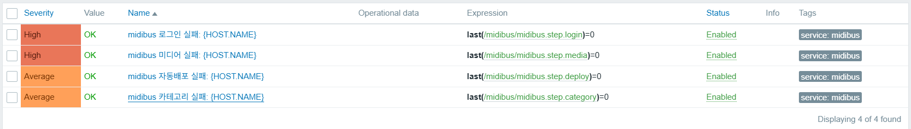

---

## 6. E2E 시나리오 구조

### 6.1 nginx Web Scenario — `nginx-availability`

연결 Trigger 3종:

| Trigger | 심각도 | Expression |
|---|---|---|
| Web scenario failed | High | `last(/nginx-sample/web.test.fail[nginx-availability])<>0` |
| Bad HTTP status (main) | High | `last(/nginx-sample/web.test.rspcode[nginx-availability,main])<>200` |
| Response time > 3s (main) | Warning | `last(/nginx-sample/web.test.time[nginx-availability,main,resp])>3` |

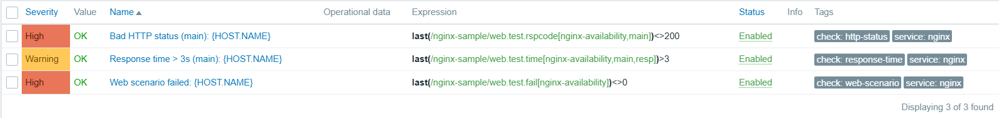

### 6.2 midibus Browser Item — 5 Step (master + dependent)

브라우저는 master에서 **한 번만** 돌고(로그인 1회 → 5스텝 순차 → `finally`에서 생성 자원 역순 삭제), 스텝별 판정은 dependent item이 반환 JSON을 분해해 얻습니다. 실행은 1회, 관측은 스텝 수만큼입니다.

| Step | 동작 | 검증 |
|---|---|---|
| 1 로그인 | ID/PW → 로그인 | 계정 드롭다운 노출 |
| 2 카테고리 | 생성 → 채널 자동배포 → 삭제 | 단계별 성공 |
| 3 미디어 | 업로드 → 확인 → 삭제 → 확인 | 목록 반영 |
| 4 보안키 | 생성(유효시간·허용IP) → 배포URL 적용 → 재생 | 플레이어 재생 |
| 5 보조사용자 | 추가 → 권한 변경 → 삭제 | 목록 권한값 |

반환 JSON의 `steps.*`(1=성공/0=실패/2=스킵)를 dependent로 분해 → 트리거 6종(`last(/midibus/midibus.step.<X>)=0`, 태그 `service:midibus` + `step:<X>`). 트리거 의존은 로그인 중심 별형으로 구성됩니다([9. 운영 정비](#9-알림-및-운영-정비)).

**스크립트 고도화** — 검증된 5-Step 스크립트에 다음을 얹었습니다(상세: [결과보고서 4장](docs/결과보고서.md)).
- **스텝 격리** — 한 스텝이 실패해도 나머지 스텝은 계속 검사(블록별 예외 처리).
- **부분 실행(`only`)** — 특정 스텝만 골라 실행(온디맨드 아이템, 개발·점검용).
- **셀렉터 대체 + self-heal** — 화면 요소 변경 시 대체 셀렉터로 시나리오 유지하고 그 변경을 관측.
- **실패 원인 추적** — 어느 서브액션에서 실패했는지 특정 + 에러 유형 분류(셀렉터/타이밍/인프라/기능).

> **왜 스텝별 별도 Browser Item이 아닌가** — 스텝마다 별도 item은 로그인 N회 반복·세션 격리로 의존 스텝이 깨지고 외부 SaaS에 N배 부하가 갑니다. 비용 분석 후 기각하고 master+dependent를 채택했습니다.

---

## 7. 가용성 정량화 (Services / SLA)

트리거는 "지금 장애냐"만 답합니다. "지난 기간 가용률이 몇 %였나"를 답하기 위해 Services 트리와 SLA를 구성했습니다.
- **Services 구성** — `Services → Edit`: 상위 서비스 `midibus E2E`(하위 중 최악 롤업) + 스텝별 하위 서비스 6개. 각 하위 서비스의 Problem tags에 `step:<이름>` 매핑(최하위에만), 서비스 태그 `sla:midibus`.
- **SLA 구성** — `Services → SLA → Create`: SLO `99.5%`, 주기 Monthly, 스케줄 24×7, Service tags `sla=midibus`. 리포트는 `Services → SLA report`.
- 장애 주입으로 문제 → 서비스 상태 → SLA 다운타임 반영의 전 구간을 검증.

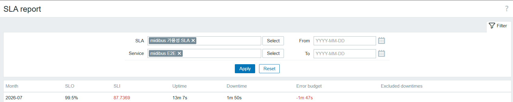

> 억제(Maintenance)된 문제는 서비스 상태·SLA 계산에서 제외됨을 소스 코드까지 추적해 확인했습니다([결과보고서 6·10장](docs/결과보고서.md)).

---

## 8. 관측 성숙도 고도화

pass/fail 판정을 넘어, 모니터링 시스템의 성숙도를 다음으로 끌어올렸습니다.

| 항목 | 내용 |
|---|---|
| 모니터 자가진단 | 데이터 끊김 감지(`nodata`) + Zabbix 엔진 상태(폴러·큐·캐시) 감시 + 외부 감시 설계 |
| 성능 열화 감지 | 페이지 로드·전송 성능을 자기 이력 대비(평소의 2배)로 판정, 장애 전 예고 |
| 컨테이너 감시 | Docker 플러그인으로 컨테이너별 CPU·메모리(특히 selenium) 수집 |
| nginx 자체 지표 | 공식 "Nginx by HTTP" 템플릿으로 stub_status 14종 수집 |
| 운영 대시보드 | 현재 문제 · SLA · 성능 추세 · 인프라 상태를 한 화면으로 |

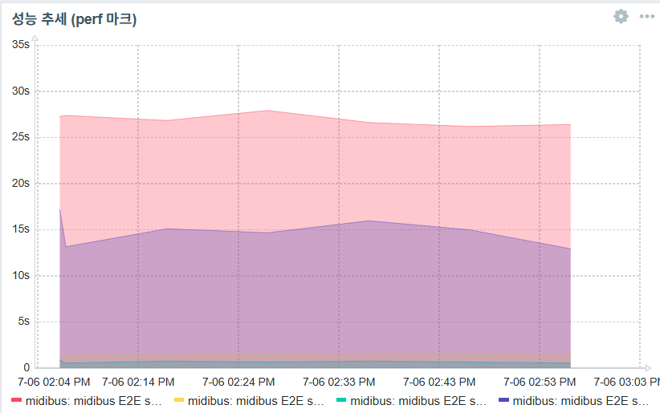

> 실측 인사이트 예: 시나리오 벽시계 약 26초, 평시 브라우저 폴러 duty 약 4.3%(단, 폴러 슬롯이 1개라 실병목은 실행이 겹칠 때의 직렬화), 부분 실행(`only=securitykey`) 약 9.9초. 상세는 [결과보고서 8장](docs/결과보고서.md).

---

## 9. 알림 및 운영 정비

### 9.1 알림 파이프라인
- **Media type** — `Alerts → Media types`: Email(SMTP) / Slack(7.0 내장, bot token `xoxb-…`). 사용자에게 연결: `Users → Users → Admin → Media` 추가.
- **Action** — `Alerts → Actions → Trigger actions → Create`: 조건 `Tag service equals <대상>` → Operations(발송) + **Recovery operations(복구 발송)**. midibus는 Slack, nginx는 Email로 분기. 에스컬레이션은 같은 Action의 Step 2(Duration 30m, 미확인 시 Email 상향)로 구성.

### 9.2 운영 정비
- **트리거 의존(별형)** — 로그인 실패 시 하위 스텝의 연쇄 알림을 억제. 동일 장애에 6건 → 1건으로 수렴.
- **에스컬레이션** — 미확인(Ack 없음)이 지속되면 이메일로 상향하는 2단 구성.
- **알림 메시지 강화** — 알림 제목에 실패 지점과 에러 유형을 표기.
- **점검창(Maintenance)** — 계획된 작업 중 알림 억제(서비스 상태·SLA도 함께 제외).

| 연쇄 알림 (억제 전) | 별형 억제 (후) |
|---|---|
| 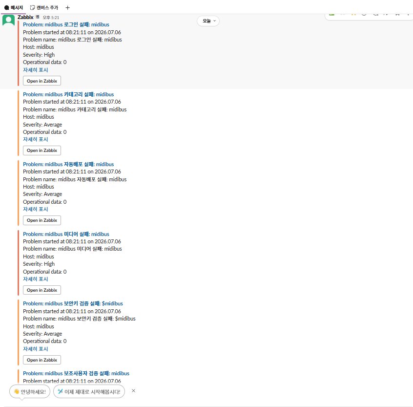 | 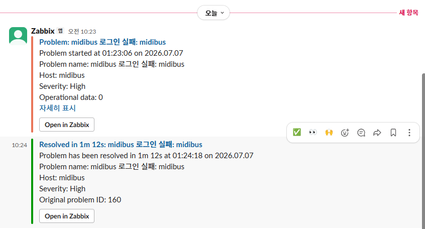 |

---

## 10. 장애 테스트

각 시나리오는 **유발 방법(명령) → 기대 결과 → 복구 → 증빙** 순으로 재현할 수 있습니다.

### 10.1 nginx — 컨테이너 중단/재기동 (전체 다운)

```bash
docker stop zbx-nginx-app     # 장애 유발
docker start zbx-nginx-app    # 복구
```

**기대 결과** — 다음 수집 주기(≤1분)에 `Web scenario failed` **PROBLEM**(High) 발생 → Action이 Email/Slack 발송 → 재기동 후 자동 **RESOLVED** + 복구 알림. `Monitoring → Problems`에서 전환 확인.

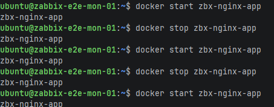

| PROBLEM | RESOLVED | Slack 알림 |
|---|---|---|
|  |  |  |

이메일 알림(PROBLEM/RESOLVED)과 Action log:

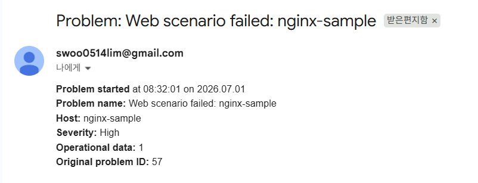
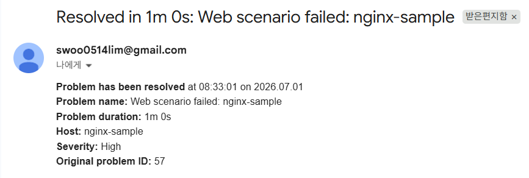

### 10.2 nginx — 응답코드 이상 (부분 장애)

nginx 설정에 의도적으로 500을 반환하는 `/fail` 엔드포인트를 두어, 전체 다운이 아닌 **응답코드 이상** 상황을 재현합니다(`Bad HTTP status` 트리거 `rspcode<>200`).

**기대 결과** — 상태코드 트리거만 PROBLEM으로 발생(응답 자체는 도달) — "죽었다"와 "이상 응답"을 구분하는 판정 계층 확인. 증빙: 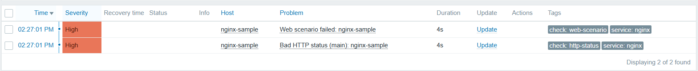

### 10.3 midibus — 자격증명 오설정 (로그인 실패)

UI 경로: `Data collection → Hosts → midibus → Macros` → `{$MIDIBUS.PASS}`를 잠깐 틀린 값으로 변경 → 다음 실행(10분 주기, 온디맨드로 즉시 가능) 후 값 복원.

**기대 결과** — 로그인 스텝 트리거 **1건만** PROBLEM(하위 5개 스텝은 별형 의존으로 억제, 6건→1건 수렴) → Slack 통지 제목에 실패 지점 표기(`[selector: login success marker]`) → 복원 후 RESOLVED.

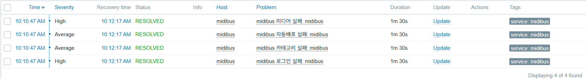

### 10.4 모니터 자가진단 — 수집 엔진 중단

```bash
docker stop zbx-selenium      # WebDriver 중단 → Browser Item 데이터 끊김
docker start zbx-selenium     # 복구
```

**기대 결과** — 스텝 트리거는 침묵하지만(마지막 성공값 유지 — `last()`의 함정), 약 25분 후 **`nodata` 트리거**가 데이터 끊김 자체를 PROBLEM으로 판정 → Slack 통지 → 데이터 복귀 시 RESOLVED. "데이터가 끊겼는데 정상으로 보고하는" 최악 실패 유형에 대한 방어를 검증합니다.

### 10.5 이중화 실측 — Zabbix Proxy · 서버 HA

compose profile로 격리된 이중화 구성의 실측 결과입니다(방법·해석: [결과보고서 11장](docs/결과보고서.md)).

| 실험 | 방법 | 실측 결과 |
|---|---|---|
| 서버 정전 버퍼링 | `docker stop zbx-server` 5분 56초 + 정속 송신 | 프록시 경유 **300/300 무손실**, 재기동 후 원 타임스탬프로 backfill |
| 캐시 포화 부하 | 캐시 128K 축소 + 2000 msg/s 버스트 | **유실 0** — 서버는 값을 버리지 않고 수용을 늦춤(backpressure) |
| HA failover | active 노드 `docker stop` / `docker kill` | standby 자동 승격 — 정상 종료 **3.6초**, 크래시 **16.6초** |
| HA+프록시 결합 | failover 진행 중 프록시 경유 정속 송신(초당 1건) | **180/180 무손실** — 승격까지의 공백을 프록시 버퍼가 보완 |

| 서버 중단 구간 — 프록시 경유(연속) | 결합 실험 — failover 중 무손실 |
|---|---|
|  |  |

재현 절차:

```bash
# 1) 실험 서비스 기동 (기본 스택 무변경 — profile 격리)
docker compose --profile proxy --profile ha up -d

# 2) 프록시 등록 + nginx-sample 호스트 전환 + 부하 랩 호스트 생성 (멱등, delete로 원상복구)
ZBX_PASS='<admin_password>' bash zabbix/provision-proxy-lab.sh

# 3) 프록시 상태 확인 — UI: Administration → Proxies (Last seen 수 초 이내)
#    HA 상태 확인 — active 노드에서:
docker exec zbx-server zabbix_server -R ha_status

# 4) 부하 스윕(레이트·시간 지정) / 저장 개수 검증
bash zabbix/burst-sweep.sh proxy 1000
ZBX_PASS='<admin_password>' bash zabbix/count-history.sh burst.proxy 120

# 5) 원상복구 — 실험 서비스만 정지·제거 (기본 6서비스는 유지)
ZBX_PASS='<admin_password>' bash zabbix/provision-proxy-lab.sh delete
docker compose --profile proxy --profile ha rm -sf zabbix-proxy zabbix-server-2
# 주의: `--profile ... down`은 기본 서비스까지 내리므로 사용하지 않습니다.
# HA를 켰던 경우 .env의 ZBX_HANODENAME1/ZBX_NODEADDRESS1 등을 비운 뒤 `docker compose up -d`로 standalone 복귀.
```

---

## 11. 트러블슈팅

전체 기록은 [TROUBLESHOOTING.md](./TROUBLESHOOTING.md)(10건). 대표 사례:
- **#1** 컨테이너 분리 환경의 "agent not available" — 인터페이스를 IP가 아닌 서비스명 DNS로.
- **#2** nginx `return` vs `auth_basic` — `return`은 access(auth) 단계를 건너뛴다 → `alias` 파일 서빙.
- **#3** Browser Item 정석 API 오판 — 대기/alert API는 전용 objects 페이지에 있다(요약본 신뢰 금지).
- **#8** 점검 중 억제된 문제가 서비스/SLA에서 제외됨을 소스 코드까지 추적해 확정.
- **#9** 5분 56초 정전을 "아무도 못 봤다" — 관측은 수집 주기(장애 < 주기면 투명)·실행 주체·backfill 여부에 종속. "그래프 공백 없음 ≠ 무장애".
- **#10** 도착이 지연되는 시스템에서 슬라이딩 시간창 카운트는 유실처럼 보이는 착시를 만든다 — 총량은 고정 버킷 집계로, 완주는 시퀀스 최댓값으로.

---

## 12. 산출물 대응표

| # | 산출물 | 위치 |
|---|---|---|
| ① | Repo | 본 저장소 |
| ② | docker-compose.yml (.env 분리) | [`docker-compose.yml`](./docker-compose.yml) · [`.env.example`](./.env.example) |
| ③ | nginx 앱 (`/`·`/health`·`/status`) | [`nginx/`](./nginx) |
| ④ | Web Scenario XML Export | [`zabbix/export/`](./zabbix/export) |
| ⑤ | Browser Item 설정·결과 | [`zabbix/midibus-browser-item.js`](./zabbix/midibus-browser-item.js) · `zabbix/export/` |
| ⑥ | Trigger·Action + 장애/복구 스크린샷 | [`images/`](./images) · [10. 장애 테스트](#10-장애-테스트) |
| ⑦ | README | 본 문서 |
| ⑧ | 결과보고서 | [`docs/결과보고서.md`](docs/결과보고서.md) |

---

## 13. 저장소 구조

```
.
├─ docker-compose.yml            # 전체 스택 (server·web·agent2·postgres·selenium·nginx)
├─ .env.example                  # 환경변수 템플릿
├─ nginx/
│  ├─ conf.d/default.conf        # / · /health · /status (+ /secure · /fail)
│  ├─ html/index.html            # 메인 페이지 (Required String)
│  └─ auth/                      # Basic Auth 자격 (고도화)
├─ zabbix/
│  ├─ midibus-browser-item.js    # Browser Item 5-Step 스크립트
│  ├─ update-item-script.sh      # 스크립트를 Zabbix API로 배포 (config-as-code)
│  ├─ set-webscenario-agent.sh   # Web Scenario User-agent 설정 (요구 4.1)
│  ├─ get-last-result.sh         # 마스터 반환 JSON 조회 (검증)
│  ├─ flaky-rate.sh              # 스텝별 성공률 집계
│  ├─ provision-burst-lab.sh     # 부하 실험 랩 프로비저닝 (burst-lab 호스트·trapper)
│  ├─ provision-proxy-lab.sh     # 프록시 등록·호스트 전환·티어다운 (10.5)
│  ├─ burst-sweep.sh             # 레이트 스윕 부하 발생기 (10.5)
│  ├─ count-history.sh           # 저장 개수 조회 (유실 판정)
│  └─ export/                    # Web Scenario / Browser Item XML Export (산출물 ④⑤)
├─ scripts/gen-htpasswd.sh       # /secure Basic Auth 자격 파일 생성
├─ images/                       # 증빙 스크린샷 (산출물 ⑥)
├─ docs/결과보고서.md            # 결과보고서 (산출물 ⑧, docx 병행)
├─ testdata/beach.mp4            # 미디어 업로드 테스트 파일
├─ TROUBLESHOOTING.md            # 트러블슈팅 10건
└─ README.md
```

> 고도화 작업의 상세 로그·설계 결정 원본은 `private/`(git 미추적)에 보관합니다. 본 저장소는 그 핵심을 공개 가능한 범위에서 정리한 것입니다.
