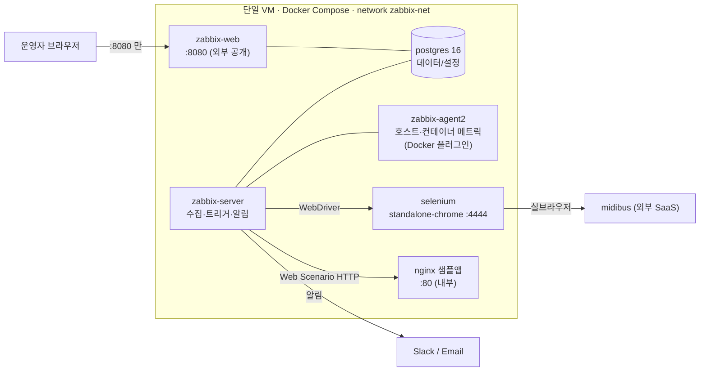

# Zabbix E2E 시나리오 기반 웹서비스 가용성 모니터링

Zabbix 7.0 LTS의 **Web Scenario**와 **Browser Item**으로 웹서비스의 E2E(End-to-End) 가용성을 감시하고, 장애 발생 시 **자동 알림(PROBLEM → RESOLVED)** 을 보내는 단일 Docker Compose 스택입니다. 서버·포트 확인을 넘어 **접속·로그인·메뉴 이동·데이터 조작**이 실제로 성공하는지를 사용자와 같은 경로로 검증합니다.


> 한 화면에서 현재 문제 · SLA · 성능 추세 · 인프라 상태를 확인하는 운영 대시보드.

- **감시 대상 ①** nginx 샘플 앱 — HTTP 다단계 체크(Web Scenario, 3 Step)
- **감시 대상 ②** midibus 웹서비스 — 실브라우저 시나리오(Browser Item, 5 Step)
- **알림** Slack / Email, 태그 기반 라우팅, 미확인 시 상향(에스컬레이션)
- **가용성 정량화** Services/SLA로 스텝별 가용성 %(SLO 99.5%)
- **배포** 단일 VM 위 `docker compose up -d`

> 설계 판단과 고도화의 상세 근거는 **[결과보고서](docs/결과보고서.md)** 에 정리했습니다.

---

## 목차

1. [개요](#1-개요)
2. [아키텍처](#2-아키텍처)
3. [사전 요구사항](#3-사전-요구사항)
4. [설치 및 기동](#4-설치-및-기동)
5. [Zabbix 초기 설정 가이드](#5-zabbix-초기-설정-가이드)
6. [E2E 시나리오 구조](#6-e2e-시나리오-구조)
7. [가용성 정량화 (Services / SLA)](#7-가용성-정량화-services--sla)
8. [관측 성숙도 고도화](#8-관측-성숙도-고도화)
9. [알림 및 운영 정비](#9-알림-및-운영-정비)
10. [장애 테스트](#10-장애-테스트)
11. [트러블슈팅](#11-트러블슈팅)
12. [산출물 대응표](#12-산출물-대응표)
13. [저장소 구조](#13-저장소-구조)

---

## 1. 개요

| 항목 | 내용 |
|---|---|
| 목적 | 서버 상태·포트 확인을 넘어 **실제 사용자 시나리오**로 서비스 품질을 검증하고, 장애를 자동 감지·통지 |
| 대상 | nginx 샘플 앱(Web Scenario) · midibus(Browser Item) |
| 핵심 기술 | Linux, Docker Compose, Zabbix 7.0 LTS, Nginx, Selenium(WebDriver) |
| 배포 | Cloud VM(Ubuntu 24.04) 단일 Docker Compose 스택 |

필수 산출물 8종을 모두 저장소에 커밋했으며, 산출물별 위치는 [13. 산출물 대응표](#13-산출물-대응표)에 정리했습니다.

---

## 2. 아키텍처



**포트 정책** — 외부로 여는 것은 **`8080`(Zabbix Web UI) 하나뿐**입니다. PostgreSQL(5432)·Server(10051)·Agent(10050)·Selenium(4444)·nginx(80)은 모두 내부 브리지(`zabbix-net`)로만 통신합니다.

**데이터 흐름** — ① Server가 nginx에 HTTP 요청(Web Scenario) / Selenium을 통해 midibus에 실브라우저 접속(Browser Item) → ② 결과를 PostgreSQL에 저장 → ③ Trigger가 판정(PROBLEM/RESOLVED) → ④ Action이 Slack/Email로 발송.

> 각 서비스·설정 키의 판단 근거(예: selenium `shm_size: 2gb`, agent2 Docker 소켓 마운트의 보안 트레이드오프)는 `docker-compose.yml` 주석과 [결과보고서 2장](docs/결과보고서.md)에 기록했습니다.

---

## 3. 사전 요구사항

| 항목 | 권장 |
|---|---|
| OS | Ubuntu 24.04 LTS (그 외 Linux 가능) |
| Docker Engine | 24.0 이상 |
| Docker Compose | v2 (`docker compose` 서브커맨드) |
| 메모리 | 4 GB 이상 (Selenium/Chrome이 `/dev/shm` 2GB 사용) |
| 네트워크 | 인바운드 `8080/tcp` 개방, 아웃바운드로 midibus 접근 가능 |

```bash
docker --version
docker compose version
```

---

## 4. 설치 및 기동

```bash
# 1) 클론
git clone <REPO_URL> zabbix-e2e-monitoring
cd zabbix-e2e-monitoring

# 2) 환경변수 파일 생성 후 값 채우기 (비밀번호는 반드시 강한 값으로)
cp .env.example .env
vi .env        # POSTGRES_PASSWORD 등 변경

# 3) 전체 기동 (단일 명령)
docker compose up -d

# 4) 상태 확인 — 6개 서비스가 running 이어야 함
docker compose ps
```

`.env` 주요 항목:

| 변수 | 용도 |
|---|---|
| `POSTGRES_USER` / `POSTGRES_PASSWORD` / `POSTGRES_DB` | Zabbix DB 자격증명 |
| `PHP_TZ` | 프론트엔드 타임존(예: `Asia/Seoul`) |
| `ZBX_SERVER_NAME` | UI 상단 설치 이름 |
| `NGINX_SECURE_USER` / `NGINX_SECURE_PASS` | `/secure` Basic Auth(고도화) |

**Web UI 접속** — `http://<VM_IP>:8080`, 최초 계정 **`Admin` / `zabbix`** → **접속 즉시 비밀번호 변경**.

> `.env`에는 마무리 실험용 knob(캐시·Kafka·HA)도 주석으로 문서화되어 있으며, 값을 넣지 않으면 공식 기본값이 적용되어 검증된 스택이 그대로 동작합니다.

---

## 5. Zabbix 초기 설정 가이드

### 5.1 에이전트 인터페이스 조정 (컨테이너 분리 구성 필수)

기본 호스트 "Zabbix server"의 Agent 인터페이스가 `127.0.0.1`이면 별도 컨테이너의 agent에 도달하지 못합니다.
- `Data collection → Hosts → "Zabbix server" → Interfaces → Agent`
- **Connect to: DNS**, **DNS: `zabbix-agent2`**, Port `10050`

(상세: [TROUBLESHOOTING.md](./TROUBLESHOOTING.md) #1)

### 5.2 Host 등록

| Host | Host group | 용도 |
|---|---|---|
| `nginx-sample` | E2E Targets | Web Scenario 대상 |
| `midibus` | E2E Targets | Browser Item 대상 |


> `midibus` 호스트의 자격증명은 **Secret 매크로** `{$MIDIBUS.USER}` / `{$MIDIBUS.PASS}`, 보안키 허용 IP는 `{$VM.EGRESS_IP}`로 분리합니다(스크립트·export에 하드코딩하지 않습니다).

### 5.3 nginx Web Scenario 등록 (3 Step)

`nginx-sample` 호스트 → Web scenarios → Create (`nginx-availability`).

| Step | URL | 검증 |
|---|---|---|
| main | `http://nginx/` | 상태 200 + Required string `Welcome to nginx` |
| health | `http://nginx/health` | 상태 200 + Required string `OK` |
| status | `http://nginx/status` | 상태 200 |


### 5.4 midibus Browser Item 등록 (5 Step)

`midibus` 호스트 → Items → Create item.

| 필드 | 값 |
|---|---|
| Type | **Browser** |
| Key | `browser.midibus.e2e` |
| Parameters | `url`, `username`={$MIDIBUS.USER}, `password`={$MIDIBUS.PASS}, `allowed_ip`={$VM.EGRESS_IP} |
| Script | [`zabbix/midibus-browser-item.js`](./zabbix/midibus-browser-item.js) |
| Update interval | 10m 이상 (미디어 업로드·인코딩 비용) |

스크립트는 웹 에디터 붙여넣기 시 손상될 수 있어 **API로 배포**합니다(config-as-code):

```bash
ZBX_PASS='<admin_password>' bash zabbix/update-item-script.sh
```

> **전제** — Browser Item 동작에는 Selenium(WebDriver) + `StartBrowserPollers>0` + `WebDriverURL`이 필요하며, 본 스택은 `zabbix-server`에 이미 설정되어 있습니다. Step 4(보안키)는 미리 배포해둔 test 영상(fixture 채널)을 사용합니다.

### 5.5 Dependent Item + Trigger

master가 반환하는 JSON을 스텝별 숫자 item으로 분해(JSONPath)하고 각 스텝에 트리거를 겁니다. (구조는 [6.2](#62-midibus-browser-item--5-step) 참고)


---

## 6. E2E 시나리오 구조

### 6.1 nginx Web Scenario — `nginx-availability`

연결 Trigger 3종:

| Trigger | 심각도 | Expression |
|---|---|---|
| Web scenario failed | High | `last(/nginx-sample/web.test.fail[nginx-availability])<>0` |
| Bad HTTP status (main) | High | `last(/nginx-sample/web.test.rspcode[nginx-availability,main])<>200` |
| Response time > 3s (main) | Warning | `last(/nginx-sample/web.test.time[nginx-availability,main,resp])>3` |


### 6.2 midibus Browser Item — 5 Step (master + dependent)

브라우저는 master에서 **한 번만** 돌고(로그인 1회 → 5스텝 순차 → `finally`에서 생성 자원 역순 삭제), 스텝별 판정은 dependent item이 반환 JSON을 분해해 얻습니다. 실행은 1회, 관측은 스텝 수만큼입니다.

| Step | 동작 | 검증 |
|---|---|---|
| 1 로그인 | ID/PW → 로그인 | 계정 드롭다운 노출 |
| 2 카테고리 | 생성 → 채널 자동배포 → 삭제 | 단계별 성공 |
| 3 미디어 | 업로드 → 확인 → 삭제 → 확인 | 목록 반영 |
| 4 보안키 | 생성(유효시간·허용IP) → 배포URL 적용 → 재생 | 플레이어 재생 |
| 5 보조사용자 | 추가 → 권한 변경 → 삭제 | 목록 권한값 |

반환 JSON의 `steps.*`(1=성공/0=실패/2=스킵)를 dependent로 분해 → 트리거 6종(`last(/midibus/midibus.step.<X>)=0`, 태그 `service:midibus` + `step:<X>`). 트리거 의존은 로그인 중심 별형으로 구성됩니다([9. 운영 정비](#9-알림-및-운영-정비)).

**스크립트 고도화** — 검증된 5-Step 스크립트에 다음을 얹었습니다(상세: [결과보고서 4장](docs/결과보고서.md)).
- **스텝 격리** — 한 스텝이 실패해도 나머지 스텝은 계속 검사(블록별 예외 처리).
- **부분 실행(`only`)** — 특정 스텝만 골라 실행(온디맨드 아이템, 개발·점검용).
- **셀렉터 대체 + self-heal** — 화면 요소 변경 시 대체 셀렉터로 시나리오 유지하고 그 변경을 관측.
- **실패 원인 추적** — 어느 서브액션에서 실패했는지 특정 + 에러 유형 분류(셀렉터/타이밍/인프라/기능).

> **왜 스텝별 별도 Browser Item이 아닌가** — 스텝마다 별도 item은 로그인 N회 반복·세션 격리로 의존 스텝이 깨지고 외부 SaaS에 N배 부하가 갑니다. 비용 분석 후 기각하고 master+dependent를 채택했습니다.

---

## 7. 가용성 정량화 (Services / SLA)

트리거는 "지금 장애냐"만 답합니다. "지난 기간 몇 % 살아 있었나"를 답하기 위해 Services 트리와 SLA를 구성했습니다.
- 상위 서비스 `midibus E2E` + 스텝별 하위 서비스 6개, 스텝 트리거를 태그로 매핑.
- SLO 99.5%(월간)로 스텝별 가용성 지표(SLI)를 산출.
- 장애 주입으로 문제 → 서비스 상태 → SLA 다운타임 반영의 전 구간을 검증.


> 억제(Maintenance)된 문제는 서비스 상태·SLA 계산에서 제외됨을 소스 코드까지 추적해 확인했습니다([결과보고서 6·10장](docs/결과보고서.md)).

---

## 8. 관측 성숙도 고도화

pass/fail 판정을 넘어, 모니터링 시스템의 성숙도를 다음으로 끌어올렸습니다.

| 항목 | 내용 |
|---|---|
| 모니터 자가진단 | 데이터 끊김 감지(`nodata`) + Zabbix 엔진 상태(폴러·큐·캐시) 감시 + 외부 감시 설계 |
| 성능 열화 감지 | 페이지 로드·전송 성능을 자기 이력 대비(평소의 2배)로 판정, 장애 전 예고 |
| 컨테이너 감시 | Docker 플러그인으로 컨테이너별 CPU·메모리(특히 selenium) 수집 |
| nginx 자체 지표 | 공식 "Nginx by HTTP" 템플릿으로 stub_status 14종 수집 |
| 운영 대시보드 | 현재 문제 · SLA · 성능 추세 · 인프라 상태를 한 화면으로 |


> 실측 인사이트 예: 시나리오 벽시계 약 26초, 평시 브라우저 폴러 사용률 약 4%(여유 약 17배), 부분 실행(`only=securitykey`) 약 9.9초. 상세는 [결과보고서 8장](docs/결과보고서.md).

---

## 9. 알림 및 운영 정비

### 9.1 알림 파이프라인
- **Media type** — Email / Slack(7.0 내장).
- **Action** — 조건 `Tag service = <대상>` → 발송 + **Recovery operations(복구 발송)**. midibus는 Slack, nginx는 Email로 분기.

### 9.2 운영 정비
- **트리거 의존(별형)** — 로그인 실패 시 하위 스텝의 연쇄 알림을 억제. 동일 장애에 6건 → 1건으로 수렴.
- **에스컬레이션** — 미확인(Ack 없음)이 지속되면 이메일로 상향하는 2단 구성.
- **알림 메시지 강화** — 알림 제목에 실패 지점과 에러 유형을 표기.
- **점검창(Maintenance)** — 계획된 작업 중 알림 억제(서비스 상태·SLA도 함께 제외).

| 연쇄 알림 (억제 전) | 별형 억제 (후) |
|---|---|
|  |  |

---

## 10. 장애 테스트

### 10.1 nginx — 컨테이너 중단/재기동

```bash
docker stop zbx-nginx-app     # 장애 유발 → Web Scenario 실패 → PROBLEM → 알림
docker start zbx-nginx-app    # 복구 → RESOLVED → 복구 알림
```


| PROBLEM | RESOLVED | Slack 알림 |
|---|---|---|
|  |  |  |

이메일 알림(PROBLEM/RESOLVED)과 Action log:


### 10.2 midibus — 자격증명 오설정

`{$MIDIBUS.PASS}`를 잠깐 틀린 값으로 바꿔 로그인 실패 유발 → 스텝 트리거 PROBLEM → 값 복원 → RESOLVED.


---

## 11. 트러블슈팅

전체 기록은 [TROUBLESHOOTING.md](./TROUBLESHOOTING.md)(8건). 대표 사례:
- **#1** 컨테이너 분리 환경의 "agent not available" — 인터페이스를 IP가 아닌 서비스명 DNS로.
- **#2** nginx `return` vs `auth_basic` — `return`은 access(auth) 단계를 건너뛴다 → `alias` 파일 서빙.
- **#3** Browser Item 정석 API 오판 — 대기/alert API는 전용 objects 페이지에 있다(요약본 신뢰 금지).
- **#8** 점검 중 억제된 문제가 서비스/SLA에서 제외됨을 소스 코드까지 추적해 확정.

---

## 12. 산출물 대응표

| # | 산출물 | 위치 |
|---|---|---|
| ① | Repo | 본 저장소 |
| ② | docker-compose.yml (.env 분리) | [`docker-compose.yml`](./docker-compose.yml) · [`.env.example`](./.env.example) |
| ③ | nginx 앱 (`/`·`/health`·`/status`) | [`nginx/`](./nginx) |
| ④ | Web Scenario XML Export | [`zabbix/export/`](./zabbix/export) |
| ⑤ | Browser Item 설정·결과 | [`zabbix/midibus-browser-item.js`](./zabbix/midibus-browser-item.js) · `zabbix/export/` |
| ⑥ | Trigger·Action + 장애/복구 스크린샷 | [`images/`](./images) · [10. 장애 테스트](#10-장애-테스트) |
| ⑦ | README | 본 문서 |
| ⑧ | 결과보고서 | [`docs/결과보고서.md`](docs/결과보고서.md) |

---

## 13. 저장소 구조

```
.
├─ docker-compose.yml            # 전체 스택 (server·web·agent2·postgres·selenium·nginx)
├─ .env.example                  # 환경변수 템플릿
├─ nginx/
│  ├─ conf.d/default.conf        # / · /health · /status (+ /secure · /fail)
│  ├─ html/index.html            # 메인 페이지 (Required String)
│  └─ auth/                      # Basic Auth 자격 (고도화)
├─ zabbix/
│  ├─ midibus-browser-item.js    # Browser Item 5-Step 스크립트
│  ├─ update-item-script.sh      # 스크립트를 Zabbix API로 배포 (config-as-code)
│  ├─ get-last-result.sh         # 마스터 반환 JSON 조회 (검증)
│  ├─ provision-burst-lab.sh     # 마무리 실험 1단계 프로비저닝
│  ├─ count-history.sh           # 저장 개수 조회
│  └─ export/                    # Web Scenario / Browser Item XML Export (산출물 ④⑤)
├─ images/                       # 증빙 스크린샷 (산출물 ⑥)
├─ docs/결과보고서.md            # 결과보고서 (산출물 ⑧)
├─ testdata/beach.mp4            # 미디어 업로드 테스트 파일
├─ TROUBLESHOOTING.md            # 트러블슈팅 8건
└─ README.md
```

> 고도화 작업의 상세 로그·설계 결정 원본은 `private/`(git 미추적)에 보관합니다. 본 저장소는 그 핵심을 공개 가능한 범위에서 정리한 것입니다.
