# Zabbix E2E 시나리오 기반 웹서비스 가용성 모니터링 프로젝트

### 결과보고서

&nbsp;

&nbsp;

| 항목 | 내용 |
|---|---|
| 작성자 | 서비스운영팀 임승우 |
| 기간 | 2026-06-30 ~ 2026-07-13 |
| 환경 | IXcloud VM (Ubuntu 24.04) · Docker Compose 단일 스택 |
| 대상 버전 | Zabbix 7.0.27 LTS |

```{=openxml}
<w:p><w:r><w:br w:type="page"/></w:r></w:p>
```

> 본 보고서는 필수 산출물 8종의 충족 근거와 그 위에 쌓은 고도화의 설계 판단을 함께 기록한다. 각 절은 "무엇을 했는가"보다 "왜 그렇게 했고 무엇을 깨달았는가"에 무게를 둔다. 마무리 실험은 당초 "부하 유실 → Kafka 완충 → 서버 이중화" 3단계로 설계했으나, 조사 과정에서 Kafka 완충안을 폐기하고(수집 버퍼링은 Zabbix Proxy의 네이티브 기능이라 재발명이었다) Zabbix Proxy(데이터 평면)와 서버 native HA(제어 평면)로 재설계했으며, 두 트랙 모두 실측까지 완결했다(11장).

---

## 목차

1. 프로젝트 개요
2. 시스템 아키텍처
3. 감시 대상 ① — nginx Web Scenario
4. 감시 대상 ② — midibus Browser Item (심층)
5. 장애 판정과 알림 체계
6. 가용성 정량화 — Services / SLA
7. 관측 성숙도 고도화
8. 실측 인사이트 요약
9. 장애 시나리오 테스트 결과
10. 트러블슈팅 대표 사례
11. 마무리 실험 — 모니터링 자신의 가용성: 부하 실측과 이중화(Proxy·HA) 실측 완결
12. 운영 전환 시 고려사항과 한계
13. 배운 점과 향후 과제
14. 부록 — 산출물 대응표와 저장소 구조

---

## 1. 프로젝트 개요

### 1.1 목표

웹서비스의 실제 사용자 여정(End-to-End)을 Zabbix로 감시해 가용성을 확보하고, 장애 발생 시 자동 알림(PROBLEM → RESOLVED) 체계를 완성한다. 서버가 살아 있는지, 포트가 열려 있는지를 확인하는 인프라 레벨 점검을 넘어, 접속·로그인·메뉴 이동·데이터 조작이 실제로 성공하는지를 사용자와 같은 경로로 검증하는 것이 핵심이다. 나아가 이 프로젝트는 "가용성을 감시하는 시스템 자신의 가용성"까지 감시 범위에 포함한다.

### 1.2 감시 대상

| 대상 | 감시 방식 | 성격 |
|---|---|---|
| nginx 샘플 앱 | Web Scenario (HTTP 다단계) | 자체 구축, HTTP 레벨 가용성 |
| midibus 웹서비스 | Browser Item (실브라우저 자동화) | 외부 SaaS, 실제 사용자 시나리오 |

nginx는 우리가 직접 구성한 대상으로 HTTP 요청·응답 레벨의 다단계 점검을 담당하고, midibus는 외부 미디어 SaaS로 실제 브라우저를 구동해 로그인부터 자원 생성·삭제까지 완주하는 시나리오를 담당한다. 두 대상은 감시의 깊이와 불안정성이 다르며, 이 차이가 이후 설계 판단의 축이 된다.

### 1.3 기술 스택

Zabbix 7.0.27(server / web / agent2), PostgreSQL 16.14, Selenium standalone-chrome(WebDriver), nginx 1.31이 모두 단일 Docker Compose 스택으로 묶여 있다. 외부에는 관리 UI 포트(8080) 하나만 노출한다. 모든 이미지는 재현성을 위해 버전을 고정했고(`:latest` 미사용), Zabbix·PostgreSQL·Selenium은 패치/빌드 수준까지, nginx는 마이너 수준까지 고정했다.

### 1.4 산출물과 평가 기준

필수 산출물 8종은 저장소, `docker-compose.yml`, nginx 앱, Web Scenario XML Export, Browser Item 설정·결과, Trigger·Action과 장애/복구 스크린샷, README, 결과보고서다. 배점은 Browser Item 25점으로 가장 무겁고, Docker·Web Scenario·Trigger가 각 15점, nginx·README·보고서·알림이 각 10점이다. 본 보고서는 배점이 가장 큰 Browser Item(4장)을 가장 깊게 다룬다. 산출물별 대응 위치는 14장 부록에 정리한다.

---

## 2. 시스템 아키텍처

### 2.1 단일 명령 기동과 서비스 구성

`docker compose up -d` 단일 명령으로 기본 6개 서비스가 기동한다. 여기에 11장 이중화 실험용 2개 서비스(`zabbix-proxy`, `zabbix-server-2`)가 compose `profiles`(proxy·ha)로 격리돼 있어, 명시적으로 `--profile`을 줄 때만 기동하고 기본 기동에는 영향을 주지 않는다(총 8서비스 정의). 자격증명과 환경값은 `.env`로 분리하며 저장소에 커밋하지 않는다.

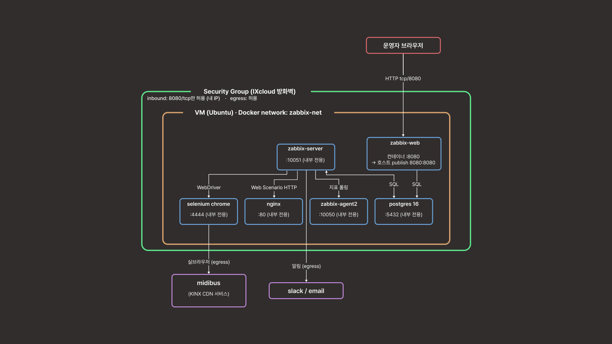

*그림 1. 시스템 아키텍처(기본 기동 6서비스 기준). 단일 VM의 docker compose 스택(network `zabbix-net`)이며, 호스트에 공개되는 포트는 zabbix-web의 8080 하나뿐이고 Security Group이 이를 허용 IP로 제한한다. 경계를 넘는 서비스 트래픽은 인입 1개(운영자→web:8080)와 egress 2개(selenium→midibus 감시, server→알림)뿐이다(관리용 SSH 22는 서비스 스택 밖의 별도 채널). 11장의 실험 프로파일(proxy·ha)을 기동하면 이 위에 zbx-proxy(이때 nginx 계열 수집의 실행 주체가 프록시로 이관)와 zabbix-server-2(standby, 같은 DB 공유)가 추가되며, 외부 노출은 그대로 8080 하나다.*

| 서비스 | 이미지(고정) | 역할 | 핵심 설정 근거 |
|---|---|---|---|
| postgres | postgres:16.14-alpine | Zabbix 데이터·설정 저장소 | healthcheck(`pg_isready`)로 서버 기동 순서 보장, `depends_on: service_healthy` |
| zabbix-server | zabbix/zabbix-server-pgsql:alpine-7.0.27 | 수집·트리거 계산·알림 중앙 | Browser Item용 `ZBX_STARTBROWSERPOLLERS=1`, `ZBX_WEBDRIVERURL=http://selenium:4444` |
| zabbix-web | zabbix/zabbix-web-nginx-pgsql:alpine-7.0.27 | 관리·대시보드 UI | 유일하게 외부 공개(`8080:8080`) |
| zabbix-agent2 | zabbix/zabbix-agent2:alpine-7.0.27 | 서버·컨테이너 지표 수집 | Docker 플러그인용 `docker.sock:ro` + `group_add: 988` |
| selenium | selenium/standalone-chrome:149.0-20260606 | Browser Item WebDriver | `shm_size: 2gb`로 Chrome 크래시 방지 |
| nginx | nginx:1.31-alpine | 감시 대상 샘플 앱 | `conf.d`·`html`·`auth` bind mount로 `/`·`/health`·`/status` 제공 |

### 2.2 네트워크와 포트 정책

모든 컴포넌트는 단일 사용자 정의 브리지(`zabbix-net`)에 붙어 서비스명 DNS로 통신한다. 컨테이너가 호스트에 공개(publish)하는 서비스 포트는 관리 UI(8080) 하나뿐이며, PostgreSQL(5432)·Server(10051)·Agent(10050)·Selenium(4444)·nginx(80)은 모두 내부 통신 전용이다. 이는 요구사항의 "8080 외 외부 차단" 조항을 그대로 구현한 것이다. 관리 채널인 SSH(22)는 서비스 스택과 별개로 Security Group에서 허용 IP 한정으로 개방되어 있다 — 서비스 평면(8080)과 관리 평면(22)을 구분해 기술한다.

`StartBrowserPollers`와 `WebDriverURL`은 요구사항서의 compose 서비스 목록에 명시되지 않았으나, Browser Item은 WebDriver 컴포넌트와 브라우저 폴러가 없으면 동작하지 않는다. 이 누락을 사전에 식별해 Day 1 compose에 selenium 서비스와 두 설정을 미리 포함했고, 그 결과 Browser Item 구현 단계에서 인프라 문제로 지체되지 않았다.

### 2.3 각 설정의 판단 근거

각 서비스와 설정 키의 판단 근거는 `docker-compose.yml` 주석에 인라인으로 기록했다. 대표적인 판단 두 가지를 옮긴다. 첫째, selenium의 `shm_size: 2gb`는 Chrome이 기본 공유메모리 64MB에서 크래시하는 문제를 막기 위한 것으로, 이 값이 없으면 Browser Item이 간헐적으로 실패한다. 둘째, agent2의 Docker 소켓 마운트는 `:ro`로 걸었지만 이는 소켓 파일의 쓰기만 막을 뿐 Docker API 호출 자체는 제한하지 못한다. 소켓 접근은 사실상 호스트 root 권한과 동급이므로, 단독 실습 VM이며 agent2가 외부에 노출되지 않는다는 전제에서만 수용했고, 실무 대안(docker-socket-proxy, cAdvisor)을 함께 문서화했다.

저장소는 공개 커밋되므로 자격증명 3종(`{$MIDIBUS.USER}`, `{$MIDIBUS.PASS}`, `{$VM.EGRESS_IP}`)은 Secret 매크로로 두고, 스크립트에 하드코딩돼 있던 VM egress IP도 `{$VM.EGRESS_IP}` 매크로로 파라미터화했다. 본 보고서와 XML Export에서 자격증명과 IP는 매크로 참조로만 표기한다.

---

## 3. 감시 대상 ① — nginx Web Scenario

nginx 샘플 앱은 `/`(메인), `/health`(200 + "OK"), `/status`(stub_status) 세 엔드포인트를 제공하고, Web Scenario `nginx-availability`가 이 세 단계를 순차 점검한다.

| Step | URL | 검증 |
|---|---|---|
| main | `http://nginx/` | 상태 200 + Required string `Welcome to nginx` |
| health | `http://nginx/health` | 상태 200 + Required string `OK` |
| status | `http://nginx/status` | 상태 200 또는 404 (요구사항 4.2의 허용 범위 — 접근 제한 환경 대비) |

각 스텝은 응답코드·응답시간·다운로드 속도를 수집하며, 실패 시 다음 세 트리거가 판정한다.

| Trigger | 심각도 | Expression |
|---|---|---|
| Web scenario failed | High | `last(/nginx-sample/web.test.fail[nginx-availability])<>0` |
| Bad HTTP status (main) | High | `last(/nginx-sample/web.test.rspcode[nginx-availability,main])<>200` |
| Response time > 3s (main) | Warning | `last(/nginx-sample/web.test.time[nginx-availability,main,resp])>3` |

응답시간 임계 3초는 baseline 실측으로 산정한 값이 아니라 웹 응답 지연의 관례적 경고 기준을 채택한 값이다. 로컬 nginx의 평시 응답은 이보다 훨씬 짧으므로 이 임계는 명백한 이상만 잡는 느슨한 상한으로 두었고, 실운영에서는 대상별 baseline을 쌓아 조정하는 것이 옳다. 요구사항 4.2는 이 조건을 Step 3(/status)에 예시하나, 사용자 체감을 대표하는 경로는 메인 페이지이므로 main 스텝에 적용했다(의도적 편차). 시나리오의 User-agent는 API 스크립트(`zabbix/set-webscenario-agent.sh`)로 `Zabbix-Monitor/1.0`을 명시해 요구사항 4.1의 Agent 설정 항목을 충족하며, 대상 접근 로그에서 모니터링 트래픽을 식별 가능하게 한다.

nginx는 알림 파이프라인의 첫 검증 대상으로도 쓰였다. 외부 SaaS인 midibus보다 장애를 확실하게 유발할 수 있으므로(`docker stop`), PROBLEM → 알림 → RESOLVED 전체 루프와 장애·복구 스크린샷을 이 대상에서 먼저 확보한 뒤 Browser Item으로 넘어갔다. 관련 화면은 Web Scenario Latest data(`images/img_1.png`), 트리거 3종(`images/img_2.png`), 장애 유발 터미널(`images/img_8.png`), PROBLEM/RESOLVED 전환(`images/img_3.png`~`img_7.png`), 이메일 알림(`images/img_9.png`~`img_11.png`)으로 남겼다.

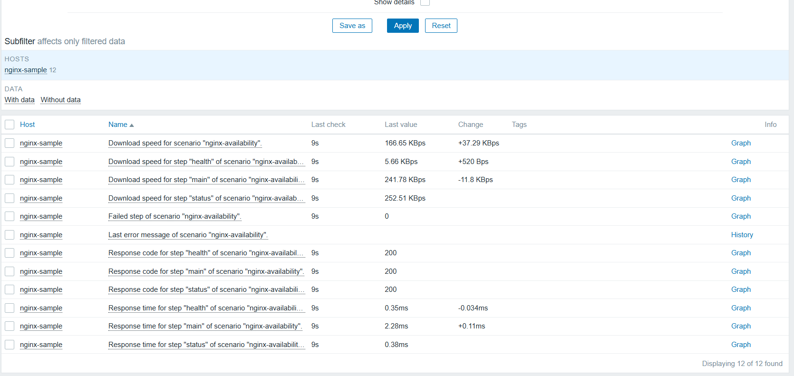

nginx 자체 지표도 공식 "Nginx by HTTP" 템플릿을 `nginx-sample` 호스트에 링크해 stub_status 파싱 14종을 수집한다. 컨테이너 내부에 agent를 설치하는 방식은 반패턴으로 기각했고, 외부에서 stub_status를 긁는 템플릿 방식과 agent2 Docker 플러그인을 병행했다.

---

## 4. 감시 대상 ② — midibus Browser Item (심층)

Browser Item은 배점이 가장 크고(25점) 본질적으로 가장 불안정한 대상이다. 외부 SaaS를 상대로 실브라우저를 자동화하기 때문이다. 이 장은 그 불안정성을 어떻게 구조로 다스렸는지를 설계 판단 중심으로 기록한다.

### 4.1 풀어야 할 세 요건

midibus 시나리오는 로그인 → 카테고리(생성·자동배포·삭제) → 미디어(업로드·확인·삭제) → 보안키(생성·재생 검증) → 보조사용자(추가·권한변경·삭제)의 5스텝이다. 이 시나리오는 세 요건을 동시에 만족해야 한다.

- **의존성** — 채널 배포는 방금 만든 카테고리를, 미디어 삭제는 방금 올린 미디어를 사용한다. 스텝이 서로의 산출물에 의존한다.
- **멱등성**(반복 실행해도 결과 상태가 같음) — Browser Item은 주기적으로 반복 실행되므로 만든 자원이 쌓이면 안 된다.
- **스텝별 분리** — 운영에서는 어느 스텝이 깨졌는지 스텝 단위로 보고·알림하고 싶다.

### 4.2 핵심 설계 — master + dependent (실행 1회, 관측 N개)

세 요건을 동시에 만족하는 구조로 master Browser Item 하나 + dependent item N개를 채택했다. 브라우저는 master에서 딱 한 번 돌고(로그인 1회, 5스텝 순차 수행, `finally`에서 생성 자원 역순 삭제), 스텝별 트리거·그래프·SLA는 dependent item이 master의 반환 JSON을 JSONPath로 분해해 얻는다.

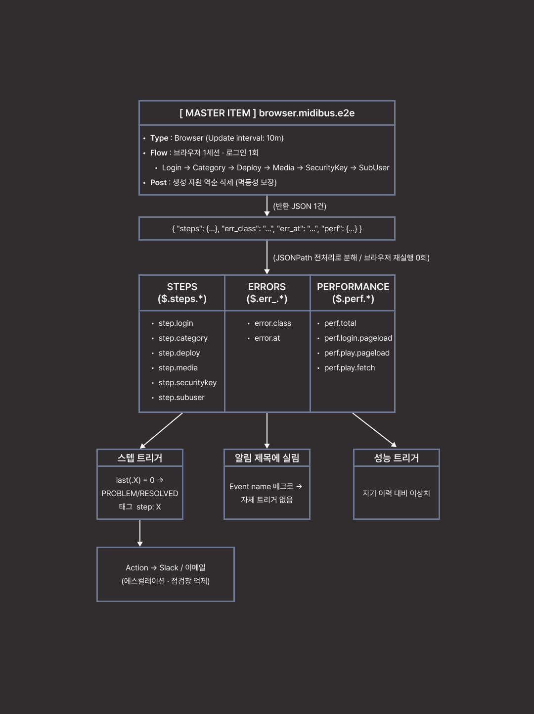

*그림 2. master + dependent 구조. master item(`browser.midibus.e2e`)이 브라우저 1세션·로그인 1회로 5스텝을 순차 수행하고 `finally`에서 생성 자원을 역순 삭제한 뒤 반환하는 JSON 하나를, dependent item들이 JSONPath로 세 무리(스텝 6 / 에러 2 / 성능 4)로 분해한다. 스텝 무리만 PROBLEM 트리거로 이어져 알림을 내고, 에러 2종은 알림 제목에 실리며, 성능 4종은 이상치 트리거로 이어진다. 브라우저는 한 번만 실행되고 관측은 스텝 수만큼 얻는다.*

이 구조를 택한 이유는 대안을 배제하는 과정에서 분명해진다. 선택지는 셋이었다.

| 항목 | (A) master item만 | (B) 스텝별 브라우저 item N개 | (C) master + dependent ★채택 |
|---|---|---|---|
| 브라우저 실행 / 로그인 | 1회 | N회 (부하·지연·flaky 증가) | 1회 |
| 의존 스텝(배포=카테고리 사용) | 가능 | 깨짐 (세션 격리) | 가능 |
| 멱등 정리 순서 | 확실 | orphan 위험 | 확실 |
| 스텝별 트리거 | 어려움 (JSON 텍스트 한 덩어리) | 가능 | 쉬움 (각 스텝=숫자 item) |
| 스텝별 그래프·이력 | 불가 (텍스트 blob) | 가능 | 가능 |
| 스텝별 심각도·태그·알림 라우팅 | 어려움 | 가능 | 가능 |
| midibus 부하 | 1× | N× | 1× |

(A)는 실행은 싸지만 결과가 JSON 텍스트 한 덩어리라 어느 스텝이 실패했는지 트리거·그래프로 나눌 수 없어 관측성을 거의 확보할 수 없다. (B)는 관측성은 얻지만 Zabbix의 각 Browser Item 실행이 독립·격리된 브라우저 세션이라는 근본 제약 때문에 스텝마다 재로그인해야 하고, 그 결과 의존 스텝이 깨지고 midibus에 N배 부하가 걸리며 flaky도 N배가 된다. Zabbix에는 item 간에 브라우저 세션을 공유·주입하는 기능이 없기 때문이다. (C)는 실행을 1회로 유지해 비용과 의존성을 지키면서, dependent item이 1회 실행 결과를 관측 가능한 여러 지표로 펼치는 어댑터 역할을 한다. 즉 dependent item은 브라우저를 재실행하지 않고 세션이 아니라 결과값을 재사용하는 유일한 통로다(master JSON이 스텝별 숫자 item으로 펼쳐진 Latest data 화면은 [그림 img_12·img_13], 스텝 트리거는 [그림 img_14]).

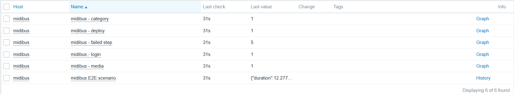

**(B)를 왜 기각했는가**는 구체적 예시로 분명해진다. 어느 날 미디어 업로드만 깨졌다고 하자. (A)라면 Problems에 "시나리오 실패"만 뜨고 JSON을 열어봐야 하며 추세도 못 본다. (C)라면 `midibus.step.media` 트리거가 정확히 "media 실패"로 뜨고, 그 item 그래프로 "3일 전부터 간헐 실패" 추세까지 보이며, 담당자에게 알림을 따로 라우팅할 수 있다. (B)도 이 관측성은 얻지만 재로그인·세션 격리·N배 부하라는 대가를 치르므로, 관측성만 취하고 대가는 피하는 (C)가 우월하다.

이 구조가 실제 설정으로 어떻게 내려가는지 미디어 스텝 한 세트로 예시한다(값은 XML Export 실값).

- **master item** — key `browser.midibus.e2e`(Type: Browser). 5스텝 결과를 하나의 JSON으로 반환한다.
- **dependent item** — key `midibus.step.media`, master는 `browser.midibus.e2e`. Preprocessing은 JSONPath 한 단계 `$.steps.media`로, master JSON에서 media 스텝의 성공 여부(1/0/2)만 뽑는다.
- **trigger** — expression `last(/midibus/midibus.step.media)=0`(값이 0이면 PROBLEM, 1로 복귀 시 자동 RESOLVED). 심각도 High, 태그 `service:midibus`·`step:media`. login 트리거(`last(/midibus/midibus.step.login)=0`)에 대한 의존을 걸어, 로그인이 깨진 상황에서는 이 트리거를 억제한다. Event name에는 `[{?last(/midibus/midibus.error.class)}: {?last(/midibus/midibus.error.at)}]`를 실어 알림 제목에 실패 분류·지점을 함께 노출한다.

나머지 스텝(login/category/deploy/securitykey/subuser)도 key와 JSONPath만 다른 동일 패턴이다. 값 2(스킵)는 `=0` 비교에 걸리지 않으므로 온디맨드 부분 실행이 오탐을 만들지 않는다(4.5절).

### 4.3 정석 API 리팩터

초기 구현은 Browser Item API를 요약본으로만 확인해 `findElement`가 요소 등장 전 `null`을 반환하는 것을 보고 직접 `for` 폴링 루프를 짜고 네이티브 `confirm`도 우회 캡처를 자작했다. 코드가 지저분하고 불안정했다. 실제로는 `setElementWaitTimeout`(암묵적 대기), `getAlert()`, `collectPerfEntries(mark)` 같은 정석 API가 모두 존재했고, 함정은 문서 위치였다. 메서드 전체 목록은 예제 페이지가 아니라 전용 페이지(`preprocessing/javascript/browser_item_javascript_objects`)에 있었다. 원문 마크다운을 직접 확인한 뒤 폴링 루프를 `setElementWaitTimeout`으로, confirm 우회를 `unhandledPromptBehavior`와 `getAlert().accept()`로, 스텝 성능을 `collectPerfEntries("login")` 같은 라벨 마크로 전면 리팩터했다. 이 리팩터로 시나리오 벽시계가 폴링 시절 230초에서 약 26초로 줄었고, 이 수치가 이후 실행 구조 논쟁의 전제를 바꾼다(4.5절).

### 4.4 멱등성

Browser Item은 반복 실행되므로 매 실행 후 계정이 기준 상태로 복귀해야 한다. 이를 위해 고정 test 이름을 쓰고(매 실행 동일 자원명), 만든 자원은 생성 역순으로 삭제하며, 정리 로직을 항상 실행되는 `finally` 블록에 두고 각 삭제를 자체 try/catch로 감쌌다. 정리 실패가 본 결과를 가리지 않고, 부분 실패해도 최대한 청소하기 위해서다. 결과적으로 성공하든 중간에 죽든 매 실행 후 계정이 baseline으로 복귀해 무한 반복해도 찌꺼기가 남지 않는다.

### 4.5 실행 구조 논쟁 — 단일 vs 분리 vs 파라미터

master + dependent에는 인지된 약점이 있었다. 모든 스텝이 하나의 Update interval을 공유하고, 앞 스텝이 실패하면 뒤 스텝은 관측되지 않으며, 특정 스텝만 골라 실행할 수 없다. 스텝별 비용도 다르다. 미디어는 업로드와 서버 인코딩 3종(FHD/HD/SD)을 유발하는 무거운 작업이고 로그인은 가볍다. 단일 interval에서는 딜레마가 생긴다. 주기를 늘리면 관문인 로그인의 장애 감지가 느려지고, 줄이면 매번 업로드·인코딩이 발생해 midibus에 실부하가 쌓인다.

세 가지 안을 놓고 논쟁했다.

| 방식 | 정기 수집 주기 차등 | 로그인 비용 | 관측 체계 영향 |
|---|---|---|---|
| 현행: 단일 master | 하나로 타협 | 1회 | — |
| 아이템 분리 (cost-tier) | 가능 (유일한 고유 가치) | tier당 1회 | dependent·트리거·서비스·SLA 재검증 |
| only 파라미터 | 불가 | 변화 없음 | 없음 (출력 구조 불변) |

결정의 전환점은 실측이었다. 정석 API 리팩터 후 `getResult().duration`을 실측한 결과 시나리오 전체가 약 26초였고, 같은 날 브라우저 폴러 busy 실측(평시 duty 약 4.3%, 단일 슬롯 직렬화가 실병목)과 합치면 딜레마의 한 축이 사라진다. 주기를 5분으로 줄여도 폴러와 세션에는 부담이 없다. 즉 자체 비용 논거는 소멸했고, midibus 부하 논거만 남는다. 그 사이 master 위에는 dependent 18종(스텝 6·failed_step 1·스텝 소요 5·에러 2·성능 4), 트리거, 서비스 트리, SLA 매핑이 쌓여 분리 비용은 오히려 커졌다.

다만 이 "여유 약 17배"는 평균 사용률 기반의 낙관적 수치임을 인정해야 한다. `StartBrowserPollers=1`이면 동시 실행 슬롯은 하나뿐이고, 실제 병목은 평균 사용률이 아니라 "실행이 겹치면 직렬화된다"는 점이다. 두 번째 실행이 앞 실행이 끝나기 전에 스케줄되면 대기하거나 밀린다. 실무 폴러 사이징은 평균이 아니라 최악 실행시간 × 동시성으로 한다. midibus가 느려져 한 회 실행이 주기(10분)에 근접하면, 평균 busy가 낮아도 폴러는 사실상 포화한다. 따라서 대상·시나리오를 늘리거나 실행시간이 주기의 상당 비율에 이르기 시작하면 `StartBrowserPollers`를 증설하는 것이 기준이다.

핵심 깨달음은 "분리냐 아니냐"의 이분법이 아니라 **요구의 분해**였다. 주기 차등(정기 수집)과 선택 실행(온디맨드)은 다른 문제이고, 지금 실재하는 요구는 후자뿐이다. 그리고 선택 실행은 아이템 분리가 아니라 스크립트 파라미터로 푼다는 것이 결정이었다.

구현은 세 가지다. 첫째, master의 params에 `only` 파라미터를 추가해 지정 스텝만 실행하고(콤마 구분, `deploy`는 `category` 별칭), 미지정 시 전체 실행(운영 기본값)한다. 둘째, login은 세션 전제라 항상 실행하며, 건너뛴 스텝은 실패(0)가 아니라 미실행(2)으로 표기해 `last()=0` 트리거의 오발동을 원천 차단한다. 셋째, 실행 통로는 전용 온디맨드 아이템 `browser.midibus.ondemand`(운영 아이템을 Clone, Disabled, dependent·트리거 없음)로 두어 알림·SLA와 완전히 격리했다.

검증 결과 `only=securitykey`는 로그인 + 보안키만 약 9.9초로, 전체 26초의 38% 수준이었다. 개발 중 무거운 스텝을 건너뛰려고 임시로 만들었던 FAST 플래그는 이 구조에 흡수·제거했다.

미디어 파일 크기와 주기가 부하를 좌우하므로, 5초·1.6MB 클립과 10분 주기, 즉시 삭제를 비용 통제 설계로 명문화했다. 합성 모니터링이 증명해야 하는 것은 "업로드 파이프라인이 살아 있는가"이고 여기에는 5초 클립과 10분짜리 영상이 같은 답을 준다. 실제 크기 영상의 인코딩 품질은 가용성 모니터가 아니라 QA·부하 테스트의 질문이다. 아이템 분리는 기각이 아니라 시점 보류이며, 시나리오가 폴러 기준 한계(약 17개)에 접근하거나 "로그인은 1~5분 감지" 수준의 주기 차등 요구가 생길 때 재개한다. 그때의 구현도 파라미터 기반 2-tier이므로, 파라미터는 미래 분리의 선행 인프라이기도 하다.

### 4.6 셀렉터 폴백, self-heal, 스텝 격리

외부 SaaS의 화면 요소는 언제든 바뀔 수 있다. 실무 인터뷰에서도 셀렉터 변경으로 인한 오탐이 흔하고 완전한 해법은 없다는 답을 받았다. 이에 검증된 5-Step 스크립트를 대규모 리팩터해 세 메커니즘을 넣었다.

- **셀렉터 폴백과 self-heal** — 요소 탐색을 `findAny` 배열로 바꿔 1순위 셀렉터부터 순차 시도하고(라운드로빈 2초씩 총 10초), 1순위가 아닌 후보가 성공하면 self-heal로 간주해 `healed_count`를 기록한다. 셀렉터가 바뀌어도 시나리오가 유지되며, 동시에 "드리프트가 발생했다"는 사실이 관측되도록 설계했다. 다만 현재는 폴백 셀렉터 후보가 아직 시딩되지 않은 상태다. 즉 배열 폴백 경로는 메커니즘(라운드로빈 프로브·healed 기록)만 검증됐을 뿐, 실제 드리프트를 후보가 흡수해 self-heal이 동작하는 것을 실증하지는 못했다. 이는 13장 향후 과제로 남긴 사항이며, 기능이 실전 검증됐다고 단정하지 않는다.
- **스텝 격리** — 단일 `try`를 `runBlock(name, fn)` 블록 격리로 바꿔, login만 치명적으로 두고 나머지 스텝은 개별 try/catch로 감싸며 실패 시 대기 상태를 복원한다. 한 스텝 실패가 나머지 검사를 막지 않는다. 클릭·입력에는 intercepted/not interactable 재시도를 두었다 — implicit wait는 요소의 존재만 보장할 뿐 상호작용 가능을 보장하지 않는다는 실측 교훈의 반영이다.
- **온디맨드 격리 배포** — 위 리팩터는 운영 아이템이 아니라 온디맨드 전용 아이템에서 먼저 검증해, 운영 아이템에 반영하기 전까지 리스크를 격리했다. 다만 온디맨드 아이템과 운영 아이템은 같은 스크립트 소스를 공유하므로, 검증된 변경을 운영 아이템에 반영하는 순간이 곧 운영 스크립트의 변경점이 된다. 격리는 "반영 시점을 통제한다"는 의미이지 변경 자체를 무위험으로 만든다는 뜻이 아니다.

격리 효과는 fault injection 시나리오 한 건으로 검증했다. `fault.js`로 category를 강제 파손하면 category·deploy는 0이 되지만 media·subuser·securitykey는 1로 정상 검사되고 `failed_step`은 2(실패 스텝의 순번 — category가 2번째 스텝. 스텝 값 체계의 "2=스킵"과는 다른 필드다), `errors.category`가 기록된다. 단일 try였다면 category 이후 전부 죽었을 것이다. 또한 파손된 category 블록이 대기 타임아웃을 소모해도 이후 블록의 소요는 정상이었다(대기 복원 검증).

스텝 격리는 트리거 의존 구조도 바꿨다. 격리 이전에는 "category 실패 → media도 실패"가 사실이라 순차 의존 체인이 옳았지만, 격리 이후에는 category 실패가 media 실패를 뜻하지 않으므로 순차 의존이 거짓이 된다. 그래서 media·subuser·securitykey는 login을 중심에 둔 방사형(star) 의존으로 재편하고, 값 오염이 실제로 전파되는 deploy → category → login만 2단 체인으로 남겼다(재편 결과 `images/img_26.png`·`img_27.png`, login 파손 시 로그인 1건만 발생하는 검증은 `images/img_28.png`, 5.3절과 연결).

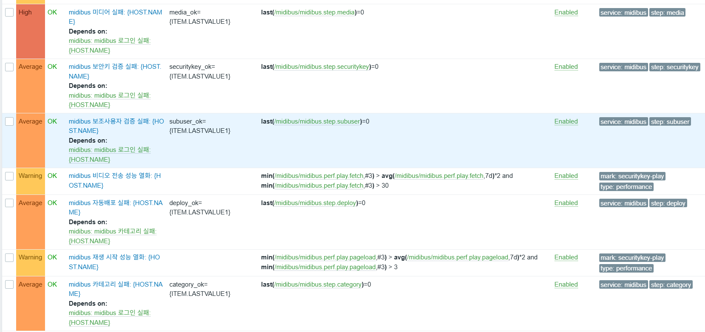

### 4.7 실패 원인 추적 — 서브액션 breadcrumb, 에러 분류, 스텝 벽시계

스텝 0/1만으로는 "미디어 실패"라는 사실은 알아도 어느 버튼에서 왜 실패했는지는 알 수 없다. 검증된 스크립트에 약 20줄의 계측만 얹어(흐름은 무변경) 세 지표를 추가했다.

- **서브액션 breadcrumb** — `find`/`findX` 진입 시 대상 이름을 crumb에 기록하고, 실패 시 `err_at`으로 서브액션 단위 실패 지점을 특정한다.
- **에러 분류** — `err_class`로 실패를 selector(드리프트) / timing(flaky) / webdriver(인프라) / logic으로 분류한다.
- **스텝 벽시계** — `step_seconds`로 스텝 블록별 소요를 잰다. 성능 마크(7.2절 참조)가 못 재는 값이다.

이 지표들은 dependent 7종(초 단위 5종 + error at/class 2종, 전부 Custom on fail = Discard)으로 추출했고, 정상 경로(전부 1, `step_seconds` 합 약 26초 정합)와 에러 경로(자격증명 fault injection → `err_at="login success marker"`, `err_class="selector"`) 양쪽을 검증했다. 실측에서 최중량 스텝이 예상한 media가 아니라 subuser(약 9초, `sleep 1.5초 × 2` + 재입력)라는 사실이 드러났다. 분류의 한계도 명시한다. 검증 마커의 not found는 화면 드리프트인지 실제 기능 장애인지 구분하지 못하므로, 이 분류의 실효는 timing·webdriver를 걸러내는 데 있다.

이 계측은 소비 지점까지 이어져야 완성이다. `err_at`·`err_class`는 사람이 가장 먼저 보는 알림 제목에 실려, 제목만으로 "무엇이·어디서·왜"가 읽히게 했다(5.3절).

---

## 5. 장애 판정과 알림 체계

### 5.1 트리거

각 dependent 값이 0이면 PROBLEM으로 판정하고, 값이 1로 복귀하면 자동 RESOLVED된다. 대표 트리거(`failed_step<>0`)와 스텝별 트리거를 함께 두어 "시나리오가 깨졌다"와 "어느 스텝에서 깨졌다"를 동시에 본다. 트리거에는 `service` 태그로 알림 경로를 분기하고(midibus → Slack, nginx → 이메일), 스텝 트리거에는 `step:<name>` 태그를 붙여 Services 트리 매핑에 쓴다.

### 5.2 알림 파이프라인

Media Type, User Media, Action을 구성해 PROBLEM/RESOLVED를 자동 통지한다. Slack은 Zabbix 7.0 내장 Media Type(bot token)을 쓰고, 이메일은 별도 Media Type으로 둔다. Action 조건은 태그(`service = midibus` 등)로 걸고, Operations(발송)와 Recovery operations(복구 발송)를 모두 둔다. 검증은 자격증명을 잠시 틀린 값으로 바꿔 로그인부터 실패시키는 방식으로, Slack·이메일 수신부터 복구 통지까지 전 구간을 확인했다. Slack PROBLEM/RESOLVED 메시지는 `images/img_16.png`, midibus 트리거 4종의 RESOLVED 전환은 `images/img_15.png`에 남겼다.

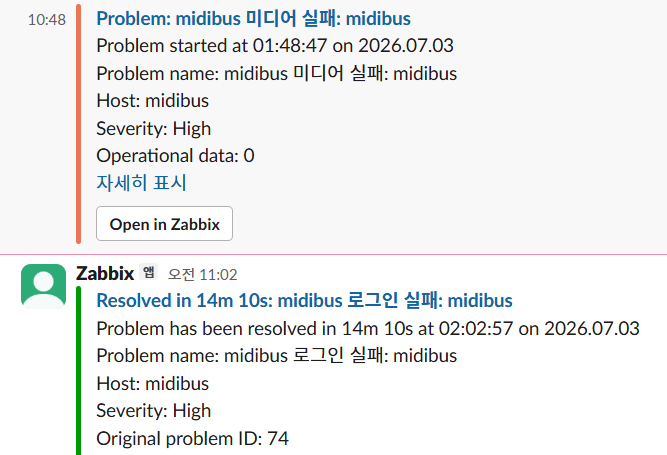

### 5.3 운영 정비

필수 알림이 동작한 뒤, 알림의 전달 품질을 높이는 네 가지 운영 정비를 추가했다. 이들은 표준 기능의 기본기 설정에 해당하므로 차별화 성과가 아니라 운영 구성으로 분류한다. 각 항목의 착수 계기가 된 실제 사건은 항목별 설명에 함께 적는다.

- **트리거 의존 관계(연쇄 알림 억제)** — SLA 검증 중 자격증명 하나가 틀리자 알림 6건이 동시에 발생했다. 원인 하나에 경보 여섯이면 실제 정보가 소음에 묻힌다. 스텝 트리거에 실행 순서 의존을 걸어 로그인 실패 시 하위 스텝의 연쇄 알림을 억제했고, 같은 주입에서 6건이 1건으로 수렴했다(`images/img_21.png` → `img_22.png`). 부수 효과로 상류 장애 중 하위 스텝이 SLA에서 "다운"으로 오염되지 않는다(모름 ≠ 다운 원칙의 스텝 단위 확장). 스텝 격리(4.6절) 도입 후에는 이 의존 그래프를 별형으로 재편했다.
- **에스컬레이션** — 알림이 1회성이라 놓치면 대응이 멈추는 구조였다. midibus 액션을 2단으로 구성해 Step 1은 즉시 Slack, Step 2는 30분 뒤 미확인(Ack 없음) 시 이메일로 상향한다. step duration을 2분으로 낮춰 검증했고, 미확인 2분 뒤 동일 문제가 이메일로 도착하는 것을 확인한 뒤 30분으로 원복했다. 여기서 Ack은 명시적 선언만을 뜻하며 Slack 열람·Resolved는 Ack이 아니라는 점을 확인했다. 상향 대기 30분은 임의로 정한 초기값이며, 온콜 정책이 확정되면 그 대응 목표에 맞춰 조정할 값이다.
- **알림 메시지 강화** — 4.7절의 `err_class`·`err_at`를 알림 제목에 실었다. 최초에는 트리거 Operational data에 표현식 매크로 `{?last(...)}`를 넣었으나 값 대신 리터럴이 그대로 출력됐다. 매크로는 전역 문법이 아니라 위치별 지원이라, 표현식 매크로는 Event name에서는 해석되지만 Operational data에서는 해석되지 않고 리터럴로 통과한다. Event name 필드로 옮겨 `midibus 로그인 실패: midibus [selector: login success marker]` 형태로 해석에 성공했다.
- **점검창(Maintenance)** — fault injection 때마다 Slack이 울리는 실측 비용이 있었고, 헬스체크 설계 때부터 "점검 중 오탐"을 함정으로 기록해 두었다. `With data collection` 점검창과 "Pause operations for suppressed problems"를 설정해 계획 작업 중 알림을 억제했다(Problems에 눈·렌치 아이콘, `images/img_23.png`). 여기서 예상을 뒤집는 발견이 있었다(6장에서 상술).

---

## 6. 가용성 정량화 — Services / SLA

트리거는 "지금 장애냐"만 답한다. "지난 기간 가용률이 몇 %였나"는 실무의 가용성 보장 요구가 항상 취하는 형태이며, 이를 답하는 층이 없었다. 과제 주제가 가용성 모니터링인데 정작 가용성이라는 숫자를 못 뽑는 상태였다. 이를 메우려 Services 트리와 SLA를 구성했다.

상위 서비스 `midibus E2E`(자식 중 최악을 롤업) 아래에 스텝별 하위 서비스 6개를 두고, 각 하위 서비스에 스텝 트리거를 `step` 태그로 매핑했다. 문제 태그는 최하위 서비스에만 허용하며 대소문자를 엄격히 맞춘다. SLA는 SLO 99.5%, Monthly, 24×7로 설정하고 서비스 태그 `sla=midibus`로 7개 서비스를 모두 매칭해 SLA report에서 스텝별 SLI를 산출한다. fault injection으로 문제 → 말단(leaf) 서비스 → 상위 롤업 → SLA Downtime 차감의 전 구간을 검증했다.

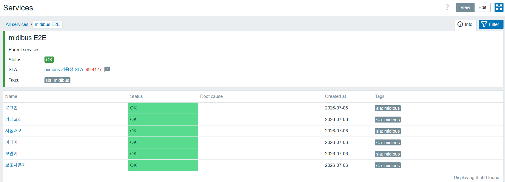 이 과정의 부수 수확으로 Disabled 상태로 방치돼 있던 category 아이템을 발견했다. 수집이 멈춘 아이템이 값 변화 없이 영원히 SLA 100%로 집계되는 상태, 즉 데이터가 끊긴 채 정상으로 보고되는 상태가 될 뻔한 것을 잡아냈다.

설계에서 의도적으로 배제한 것도 있다. 헬스체크(모니터 자가진단) 지표는 서비스 트리에 넣지 않았다. 모니터가 관측하지 못하는 시간은 서비스의 "다운"이 아니라 "모름"이며, 이를 SLA에 넣으면 가용성이 왜곡된다. 성능 지표도 마찬가지로 SLA에서 배제했다. Zabbix SLA는 이진 집계라 "느림"을 넣으면 "다운"으로 세기 때문이다.

여기에는 정직하게 남겨 둔 위험이 하나 있다. selenium이 중단돼 master가 약 25분간 데이터를 못 보내는 동안, 스텝 서비스의 판정은 `last()=0`이 아니라 마지막 성공값(1)을 계속 들고 있으므로 해당 구간 SLA가 100%로 집계될 수 있다. 이는 4.5절에서 다룬 `last()=0`이 값이 끊겨도 마지막 값을 유지하는 함정과 같은 구조가 SLA 층에서 재현되는 것이다. 현재 이 blind window(데이터가 끊긴 관측 공백 구간) 자체는 헬스체크 3층의 nodata 트리거(7.1절)가 PROBLEM으로 잡아 사람에게 알리지만, 그 사실이 SLA 집계에 자동으로 반영돼 해당 구간을 "모름/다운"으로 소급 차감하지는 않는다. 즉 감지는 되나 SLA 수치 보정은 미해결이며, 향후 nodata 상태를 SLA 계산에 연결하는 것이 과제로 남는다. 그동안 이 공백 구간은 SLA 리포트에서 수동 Excluded downtime으로 소급 처리하는 운영 규칙으로 관리한다.

**깊이 있는 발견 — suppressed 문제는 SLA에서 제외된다.** 점검창에서 fault injection을 하자 Problems에는 문제가 생성됐는데(suppressed, 눈 아이콘) SLA Downtime이 증가하지 않았다. "점검창은 알림만 끄고 SLA는 별도로 집계된다"라던 예상과 반대였다. 층을 갈라 판별하니 억제 중 Services의 해당 서비스가 OK(초록)를 유지했다. 즉 SLA가 아니라 서비스 층이 suppressed 문제를 무시하는 것이다. 2026-07 기준 7.0 공식 문서 8곳 이상을 확인했으나 이 규칙의 명시 조항을 찾지 못해, 소스 코드에서 확정했다. `service_manager.c`(release/7.0)의 `db_update_services()` 심각도 집계 루프에 `if (NULL != event->maintenanceids) continue;`가 있어, maintenance로 suppressed된 이벤트는 심각도 비교에 도달하기 전에 건너뛰어진다. 보너스로 억제 해제 시 서비스가 재계산되므로, 점검창이 닫힌 순간부터 잔존 문제의 SLA가 깎이기 시작한다(점검창을 열어두고 잊으면 안 되는 근거). 이 동작은 release/7.0 소스 기준이므로, 버전 업그레이드 시 회귀 테스트 항목으로 등록해 유지 여부를 확인한다. 이 발견으로 사전 계획 작업은 Maintenance 하나로 알림과 SLA가 함께 보호되고, SLA Excluded downtimes는 소급 제외용으로 역할을 재정의했다.

---

## 7. 관측 성숙도 고도화

필수 파이프라인이 끝났을 때 시스템이 할 수 있는 말은 "방금 장애가 났다" 하나였다. 고도화 각각은 그 시스템이 대답하지 못하는 질문을 하나씩 찾아 메운 것이고, 대부분 상상이 아니라 실제 사건·실측에서 드러난 결핍에서 출발했다. 관통하는 흐름은 모니터 자신(헬스체크) → 증명(SLA) → 예고(성능) → 원인(추적) 순이며, 각 단계의 결핍이 다음 작업을 지목했다.

### 7.1 모니터 자가진단 3층

모든 판정이 `last()=0`인데, 이 함수는 값이 끊기면 마지막 성공값을 들고 영원히 정상이라 답한다. 데이터가 끊긴 상태에서 정상으로 보고하는 것은 모니터링의 최악 실패 유형이다. 이를 세 층으로 방어했다. 층을 나눈 근거는 구조적이다. 데이터 침묵(층1), 엔진 포화(층2), 서버 사망(층3)은 서로 다른 메커니즘으로 죽고, 층3은 원리적으로 내부에서 관측할 수 없다.

| 층 | 감시 대상 | 구현 | 상태 |
|---|---|---|---|
| 층1 | 데이터 끊김 | 트리거 `nodata(/midibus/browser.midibus.e2e,25m)=1` — 여유 25분은 수집 주기(10분) 2회 연속 미도착 + 5분 여유로 산정, 단발 실행 실패(flaky)를 끊김으로 오판하지 않기 위한 배수 설계 | 배포·E2E 검증 완료 |
| 층2 | 엔진 포화 | Zabbix server 내부 아이템(브라우저 폴러 busy, queue, `wcache pused`) | 배포 존재, 검증·용량 해석 수행 |
| 층3 | 서버 통째 사망 | 외부 watchdog | 설계 문서 (여력 시 PoC) |

층1은 selenium을 정지시켜 약 25분 무데이터 → PROBLEM → Slack → 데이터 복귀 시 RESOLVED까지 end-to-end로 검증했다. nodata는 아이템이 unsupported여도 마지막 값 이후 경과시간 기준으로 계산된다는 동작을 실측으로 확인했다. 한 가지 전제를 명시한다. `nodata()`는 프록시 경유 호스트에서는 기본(비-strict) 모드일 때 프록시 지연·재접속을 감안해 발동을 보류하는 동작이 있으므로, 감시 대상을 프록시 뒤로 이관하면(11장) 층1 트리거의 발동 조건 재검토(strict 파라미터)가 필요하다. 층2는 배포판에 이미 링크·트리거가 있으므로 우리 기여는 구현이 아니라 검증·용량 해석이며, 이 과정에서 폴러 용량을 실측해 아래 8장의 인사이트를 얻었다. 헬스 트리거는 서비스가 아니라 인프라 사안이므로 Slack이 아니라 대시보드로 노출한다.

### 7.2 성능 열화 감지

열화는 보통 실패 전에 지연으로 먼저 온다. 로그인이 2초에서 15초가 돼도 0/1 체계에서는 무음이다. 성능 데이터는 이미 매 실행 `collectPerfEntries`로 수집되고 있었으므로 비용 0으로 얻는 관측 층이다. perf 아이템은 네 종이다. total(시나리오 전체 소요), login pageload(로그인 후 페이지 로드), play pageload(재생 페이지 로드), 그리고 play fetch다. play fetch는 보안키가 적용된 재생 URL을 열 때 브라우저가 실제 비디오 세그먼트를 내려받는 데 걸린 응답시간을 잰다. 이 시간은 곧 CDN이 영상 데이터를 전송하는 속도를 반영하므로, play fetch가 느려진다는 것은 CDN 전송이 느려졌다는 신호로 읽는다. 단, 이 지표만으로 CDN을 단정하지 않으며 다른 perf 지표와 교차 확인을 전제로 한다. 이 4종에 각각 Warning 트리거를 달았다. 트리거는 `avg(7d)*2`에 절대 하한과 `min(#3)`을 결합한 3중 오탐 방지로 구성하고, `type:performance` 태그만 붙이고 step·service 태그는 붙이지 않아 SLA 오염을 차단했다. 발동 검증(임계 임시 하향 → Problems 발동)과 격리 검증(Slack 미수신, SLA 무영향)을 모두 통과했다. 마크는 스텝 벽시계가 아니라 그 시점 페이지의 W3C 타이밍이라는 한계를 확인했고, 그래서 진짜 스텝 시간은 스크립트 측정(4.7절)으로 이월했다.

### 7.3 운영 대시보드

앞의 관측이 Problems·Services·SLA·Latest data에 흩어져 있어 장애 대응의 첫 비용이 "화면 찾기"가 됐다. `midibus E2E 운영 대시보드`를 만들어 "지금 아픈가 → 약속 지키나 → 왜"의 독해 순서로 배치했다. Problems, SLA report, 핵심 현재값(failed_step, perf total), perf 4종 이중축 그래프(스케일 다른 지표는 축 분리), 스텝 상태 계단 그래프와 Honeycomb 상태판, 인프라 헬스(폴러 busy, queue, nginx connections)를 한 화면에 모았다. 스텝 상태 그래프는 각 스텝의 값(성공 1, 실패 0)을 선으로 그리는데, 평상시에는 모든 스텝이 1이라 여러 선이 맨 위 같은 높이에 겹쳐 하나처럼 보인다. 이는 오류가 아니라 의도된 모습이다. 이 그래프에서 정보가 되는 것은 어떤 선이 0으로 내려가 무리에서 이탈하는 순간뿐이기 때문이다. 따라서 순간적인 장애 판정은 그래프가 아니라 트리거로 보고, 그래프는 추세와 이탈 확인용으로 둔다.

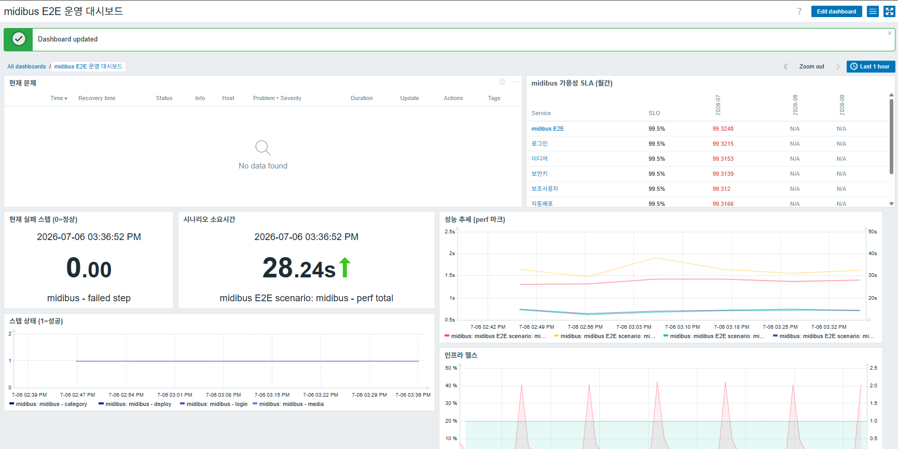

### 7.4 컨테이너 리소스와 nginx 자체 지표

평시 폴러 duty가 약 4.3%로 낮아 진짜 병목은 selenium 리소스라는 결론이 났고, 그래서 컨테이너 감시로 갔다. agent2 Docker 플러그인(docker.sock + group_add)으로 "Docker by Zabbix agent 2" 템플릿을 링크해 컨테이너 6개 × 42종을 LLD로 자동 생성했다. selenium 유휴 메모리 354MB와 OOMKilled·Restart count 관측을 개시했다. `shm_size 2gb`로 예방하던 실패 모드가 이제 관측 가능해졌다. nginx 자체 지표 수집("Nginx by HTTP" 템플릿)과 컨테이너 내부 agent 설치를 반패턴으로 기각한 근거는 3장에 정리했으므로 여기서는 반복하지 않는다.

---

## 8. 실측 인사이트 요약

고도화 과정에서 얻은 정량 실측을 모은다. 이 수치들은 이후 설계 판단(주기, 분리 여부, 병목 지목)의 근거가 됐다.

| 지표 | 실측값 | 의미 |
|---|---|---|
| 시나리오 벽시계 | 약 26초 (`$.duration`) | 폴링 시절 230초에서 정석 API 리팩터로 단축. 이후 용량 해석의 기준값 |
| 평시 브라우저 폴러 busy | 약 4.3% | 평균 duty ≈ 4.3%(실행 26초 / 주기 600초). 단 `StartBrowserPollers=1`이라 슬롯은 1개이므로 실제 병목은 평균 사용률이 아니라 실행이 겹칠 때의 직렬화다. "여유 17배"는 평균 기반 상한 추정일 뿐 동시성 여유가 아니다. 초기 40% 해석은 26초 실행이 1분 샘플창에 통째로 들어간 순간값의 오독이었다 |
| `only=securitykey` 소요 | 약 9.9초 | 로그인 + 보안키만. 전체 26초의 38% |
| 최중량 스텝 | subuser 약 9초 | 예상한 media가 아님. `sleep 1.5초 × 2` + 재입력이 원인 |
| selenium 유휴 메모리 | 약 354MB | 컨테이너 감시로 관측 개시. 진짜 병목 후보 |

초기 폴러 용량 해석 오류를 정정한 과정은 기록해 둘 가치가 있다. 순간 샘플값 40%를 지속 부하로 읽어 "여유 1.9배"로 잘못 해석했으나, `$.duration` 실측으로 시나리오가 26초임을 확정하면서 평시 busy가 약 4.3%, 여유가 약 17배임을 바로잡았다. 실측값 자체는 정확했고 해석이 틀렸던 사례다. 다만 이 "약 17배"는 평균 사용률 기준의 값이라는 점을 함께 명시해 둔다. `StartBrowserPollers=1`에서 동시 실행 슬롯은 하나뿐이고 실제 병목은 실행이 겹칠 때의 직렬화이므로, 폴러 사이징은 평균이 아니라 최악 실행시간 × 동시성으로 판단해야 한다(4.5절). 17배는 상한이 아니라 여유가 크다는 방향 지표로만 읽는다.

---

## 9. 장애 시나리오 테스트 결과

fault injection으로 판정·알림·격리·자가진단의 전 경로를 실증했다. 장애·복구 화면은 `images/`에 남겼다.

| 시나리오 | 유발 방법 | 기대·결과 | 증빙 |
|---|---|---|---|
| nginx 정지 | `docker stop zbx-nginx-app` | Web scenario failed PROBLEM → 이메일/Slack → 재기동 시 RESOLVED | `img_3`·`img_5`·`img_8` |
| nginx 응답코드 이상 | `/fail`(의도적 500) 요청 | `rspcode<>200` 트리거 PROBLEM | `img_4` |
| nginx 이메일 알림 | 위 장애 루프 | PROBLEM·RESOLVED 메일 수신, Action log Sent | `img_9`~`img_11` |
| midibus 자격증명 오류 | `{$MIDIBUS.PASS}` 임시 오설정 | 로그인 스텝 실패 → Slack → 복원 시 RESOLVED | `img_15`·`img_16` |
| 스텝 격리 | `fault.js`로 category 강제 파손 | category·deploy=0, media·subuser·securitykey=1, failed_step=2, errors.category | 실행 로그·Latest data로 확인, 캡처 미보관 |
| 연쇄 알림 억제 | login 파손 | Problems 로그인 1건으로 수렴(6건 → 1건) | `img_21`·`img_22`·`img_28` |
| 성능 트리거 격리 | perf 임계 임시 하향 | Problems 발동, Slack 미수신, SLA 무영향 | Problems 이력으로 확인, 캡처 미보관 |
| 에스컬레이션 | 미확인 2분 유지 | 동일 문제 이메일 상향 도착 | 이메일 수신·Action log로 확인, 캡처 미보관 |
| 점검창 억제 | 점검창 안 fault injection | Slack 무음, Problems 눈 아이콘, SLA 미반영 | `img_23` |
| 모니터 자가진단 | selenium 정지 | 약 25분 후 nodata PROBLEM → Slack → 복구 시 RESOLVED | Problems 이력으로 확인, 캡처 미보관 |
| 서버 정전(프록시 버퍼링) | `docker stop zbx-server` 5분 56초 | 프록시 경유 수집 무손실(300/300)·backfill, 서버 직접 수집만 공백 | `img_31`·`img_32` |
| 수집 포화(backpressure) | 캐시 128K 축소 + 2000 msg/s 버스트 | 유실 0 — 서버가 값을 버리는 대신 수용을 늦춤(송신 3분+로 지연) | `img_33`~`img_35` |
| HA failover(정상/비정상 종료) | active 노드 `docker stop` / `docker kill` | standby 자동 승격 — 정상 종료 3.6초, 크래시 16.6초(failover delay 10초 설정) | `img_40`·`img_45` |
| HA+프록시 결합 | failover 진행 중 프록시 경유 정속 송신(초당 1건) | 승격까지의 공백 동안 프록시가 버퍼링 → 180/180 무손실 | `img_46` |

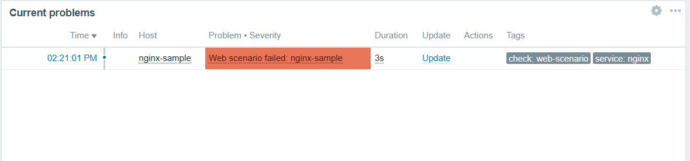

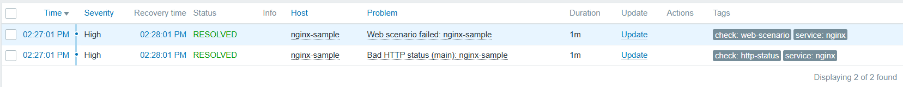

증빙 이미지는 모두 `images/` 아래에 있다. 개인 이메일이 보이는 이메일 알림 캡처(`img_9`~`img_11`)는 공개 시 주소를 마스킹했고, 내부 시나리오·도메인이 노출되는 자료는 공개 저장소에서 제외했다.

---

## 10. 트러블슈팅 대표 사례

전체 10건은 `TROUBLESHOOTING.md`에 발생 시점에 기록했다. 이 중 인사이트가 뚜렷한 9건을 옮긴다(#7 제외).

- **#1 컨테이너 분리 환경의 "agent not available".** 기본 호스트의 Agent 인터페이스가 `127.0.0.1`이면 server 컨테이너의 자기 자신을 가리켜 별도 컨테이너의 agent에 도달하지 못한다. Active(agent → server)는 정상, Passive(server → agent)만 실패하는 방향성으로 진단했다. 인터페이스를 고정 IP가 아니라 서비스명 DNS(`zabbix-agent2`)로 두어 해결했다. 컨테이너 IP는 재시작 시 가변이므로 항상 서비스명 DNS를 쓴다.
- **#2 nginx `return` vs `auth_basic`.** `/secure`를 자격 없이 요청했는데 401이 아니라 200이 반환됐다. nginx는 지시어 작성 순서가 아니라 처리 단계(rewrite → access → content) 순서로 동작하는데, `return`은 rewrite 단계에서 요청을 즉시 종료해 access 단계의 auth 검사를 건너뛴다. `return` 대신 `alias` 파일 서빙으로 바꿔 access 단계를 통과하도록 했다.
- **#3 Browser Item 정석 API 오판.** 대기·alert API가 없는 줄 알고 우회를 자작했으나, 실제로는 존재했고 함정은 문서 위치였다(4.3절). "기본 기능이 없어 보이면 내가 레퍼런스를 놓친 신호"로 의심하고, API 존재 여부는 요약이 아니라 원문에서 확인한다.
- **#4 웹 에디터 붙여넣기 손상 → API 배포.** 웹 편집기가 긴 JS를 손상시켜 parse error가 났다(유니코드 화살표가 Duktape 파서를 깨뜨린 사례 포함, 주석은 ASCII로 통일). Zabbix API `item.update`로 스크립트를 배포해 우회했고, 부수 효과로 config-as-code(버전관리·재현 가능 배포)를 달성했다.
- **#5 보안키 재생 검증의 허용 IP는 실행 주체의 egress IP.** 보안키에 허용 IP를 걸면 재생 URL이 그 IP에서만 재생된다. E2E에서 재생 URL을 여는 주체는 사람의 브라우저가 아니라 selenium 컨테이너이므로, 출발 IP는 사람이 보는 자기 브라우저 IP가 아니라 VM 공인 egress IP다. 허용 IP를 이 값(`{$VM.EGRESS_IP}` 매크로)으로 잡아야 재생이 통과한다. IP 기반 접근제어를 자동화로 검증할 때 기준은 항상 테스트 실행 주체의 egress IP다.
- **#6 표현식 매크로의 위치별 지원.** 매크로가 리터럴로 출력되면 문법 오류가 아니라 미지원 위치 신호다. 사용 전 "Macros supported by location" 표에서 위치를 확인한다(5.3절).
- **#8 점검창 중 SLA 미반영을 소스까지 추적.** 문서에 없는 동작을 소스 코드로 확정했다(6장). "내가 못 찾음 ≠ 문서에 없음 ≠ 근거 없음"이며, 문서가 침묵하면 다음 원천은 소스다.
- **#9 5분 56초 정전을 "아무도 못 봤다".** 11장 정전 실험에서 10분 주기 아이템은 정전이 실행 사이에 들어가 무증상이었고, 프록시 경유 아이템은 backfill로 공백이 사후에 메워졌다. 같은 장애도 아이템마다 다르게 "보인다" — 관측은 수집 주기(장애 < 주기면 투명)와 실행 주체(서버/프록시), backfill 여부에 종속된다. "그래프에 공백이 없다 ≠ 장애가 없었다"이며, nodata 여유시간을 주기의 배수로 설계해야 하는 실측 근거다.
- **#10 저장개수가 셀 때마다 다르다 — 시간창 측정의 함정.** backpressure로 도착이 3분+에 걸쳐 늘어진 상태에서 "지금부터 과거 N초" 창으로 세면 측정값이 요동쳐 유실처럼 보인다. 총량 판정은 고정 구간(DB 버킷 집계)으로, 완주 판정은 시퀀스 최댓값으로 분리해 해결했다. 도착이 지연되는 시스템에서는 측정 방법 자체가 오판의 원인이 된다.

---

## 11. 마무리 실험 — 모니터링 자신의 가용성: 부하 실측과 이중화(Proxy·HA) 실측 완결

"가용성을 감시하는 시스템은 자기부터 가용해야 한다"는 문제의식에서 출발해 모니터링 시스템의 세 가지 실패 모드(수집 유실 / 완충 부재 / 서버 단일 장애)를 다루는 3단계 실험을 설계했고, 전 단계를 실측까지 완결했다.

**설계 변경의 기록 — Kafka를 폐기한 이유.** 당초 2단계는 "Kafka를 수집 앞단에 두어 버스트를 완충"하는 안이었다. 그러나 조사 결과 "수집 버퍼링 + 서버 다운 시 무손실"은 Zabbix Proxy가 store-and-forward로 제공하는 네이티브 기능이었고, Kafka를 ingress에 붙이는 것은 이 기능의 재발명이었다. Kafka의 정당한 자리는 반대 방향(egress — Zabbix 이벤트를 외부 분석계로 내보내는 7.0 real-time export/connector)이며 이는 설계로만 보존했다. 그래서 2단계를 Zabbix Proxy(데이터 평면: 수집 버퍼링·분산)로 교체하고, 3단계 서버 native HA(제어 평면: 트리거·알림의 생존)와 함께 실측했다. 둘은 선후 단계가 아니라 서로 다른 평면을 지키는 독립 축이며, 마지막 실험(E4)이 두 축의 상보성을 실증한다.

| 단계 | 질문 | 실측 결과 |
|---|---|---|
| ● 1. 부하 유실 실측 | 직접 수집은 부하에서 데이터를 잃나 | **유실점은 관측되지 않았다** — 캐시 포화 시 서버는 값을 버리는 대신 수용을 늦춘다(backpressure). 통설("캐시 100% = 유실")을 실측으로 기각 |
| ● 2. Zabbix Proxy | 서버가 죽어도 수집 데이터가 사나 | 정전 5분 56초 동안 **300/300 무손실**, 재기동 후 원래 타임스탬프로 backfill. Web Scenario도 프록시가 계속 실행 |
| ● 3. 서버 native HA | 서버가 죽어도 관제(판정·알림)가 사나 | standby 자동 승격 — 클린 종료 **3.6초**, 크래시 **16.6초**(failover delay 10s + last-access 갱신 주기, 공식 산식 봉투 내) |
| ● 결합(E4) | failover 공백조차 무손실인가 | failover 진행 중 정속 송신(초당 1건) **180/180 무손실** — standby 승격까지의 공백을 프록시 버퍼가 덮는다 |

**1단계 — 부하 유실 실측: 가설이 기각되다.** 캐시 유실은 공식 문서가 단정하는 사실이 아니라 실측할 가설이었다. 공식이 확정하는 것은 유한한 캐시(`HistoryCacheSize` 기본 16M)와 DB syncer(기본 4) 병목, 높은 사용률에서의 성능 저하까지다. Config-as-Code(`provision-burst-lab.sh`·`count-history.sh`·`burst-sweep.sh`)로 계수 파이프라인을 만들고, 기본 캐시(16M)에서 5000개 버스트로 계수 파이프라인 baseline 검증(저장 5000, 유실 0 — 16M을 포화시키지 못하는 자명한 결과이므로 배관 정상의 확인이지 유실 감지의 증명이 아니다)을 마친 뒤, 캐시를 문서상 최소 128K·syncer 1로 줄인 실험 통제 상태에서 1000·2000 msg/s 스윕을 실행했다. 결과는 가설의 기각이었다. 캐시가 0↔100%를 톱니로 진동(peak 99.9%)하는 포화 상태에서도 저장은 60,000/60,000, 120,000/120,000으로 유실 0이었고, 대신 2000 msg/s에서는 60초분 송신이 3분 이상으로 늘어졌다. 서버는 값을 버리지 않고 수용을 늦추며, 동기식 sender는 응답 대기로 강제 감속된다(backpressure). 이 거동은 소스 코드에서도 확인된다 — 히스토리 캐시에 값을 넣는 `hc_add_item_values()`(`src/libs/zbxcachehistory/cachehistory.c`, release/7.0)는 캐시가 가득 차면 "History cache is full. Sleeping for 1 second." 로그와 함께 공간이 생길 때까지 대기하는 루프로 구현되어 있어 드롭 경로 자체가 없다. 즉 무손실은 우연한 관측이 아니라 구현상의 설계이며, 실측은 그 설계를 확인한 것이다. 단, 반복은 레이트당 1~2회(2,000 msg/s는 재검증 포함 2회)로 제한적이고 판정은 동기 단일 sender 조건에 한정되며, 비동기·병렬 다중 소스에서의 거동은 미검증이다. 부수 관찰로 층2 자가진단 트리거("Excessive history cache usage >75%")가 실험 부하를 감지·해소 확인했다(`images/img_35.png`).

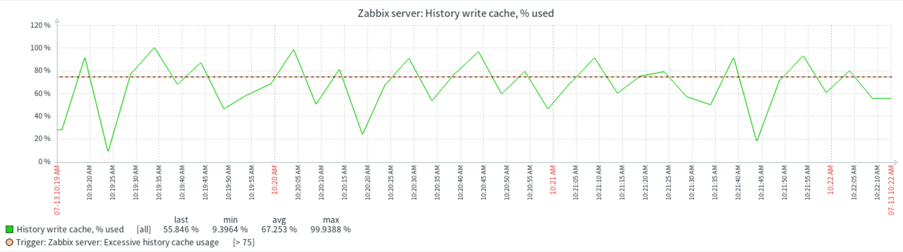

**2단계 — Zabbix Proxy: store-and-forward 실증.** 구성의 각 선택에는 기각한 대안이 있다.

| 선택 | 고려한 대안 | 채택 근거 |
|---|---|---|
| **Active 모드**(`ProxyMode=0` — 프록시가 서버로 접속) | Passive(서버가 프록시를 폴링) | 프록시의 실전 배치처(원격 POP·DMZ)는 인바운드를 열 수 없는 경우가 일반적이다. Active는 안→밖 단방향 TCP 1개(방화벽 규칙 1개)로 끝나고 서버 쪽에 프록시 주소 설정도 불필요 — 공식 문서가 명시한 실무 기본형 |
| **sqlite3 내장 빌드** | proxy-mysql/pgsql(외부 DB 컨테이너) | "프록시 DB는 서버 DB와 반드시 분리(공유 시 구성 파손)"라는 공식 경고가 있는데, 내장 sqlite는 이 함정을 구조적으로 제거한다. 데모 규모에서 외부 DB는 관리 대상만 늘린다 |
| **hybrid 버퍼** + `ProxyMemoryBufferSize=16M` | disk(업그레이드 환경 기본) / memory 단독 | 평시 메모리 속도로 돌다가 셧다운·버퍼 초과 시 디스크로 flush — 속도와 유실 방어를 겸하며 7.0 신규 설치 권장값과 일치. memory 단독은 프록시 종료 시 버퍼가 폐기된다. `ProxyMemoryBufferAge`는 기본 0을 유지했다(시간 기준 디스크 전환 트리거인데, 실험 데이터량에선 발동 조건 자체가 성립하지 않아 파라미터만 늘어난다) |
| **이관 대상 = nginx-sample** | midibus 이관 | 검증 완료된 midibus 5-Step 파이프라인을 건드리는 것이 이 트랙의 최대 리스크였다. midibus는 서버 직접 감시로 남겨 **같은 정전에서 "프록시 경유 vs 서버 직접"의 대조군**으로 활용했고, 그 대비가 곧 E1의 증빙 그림이다 |

`ProxyOfflineBuffer`는 기본 1시간을 유지했다 — 실험 정전(6분)을 충분히 커버해 바꿀 이유가 없었다. 이렇게 compose에 프록시를 profile 격리로 추가하고, API(`provision-proxy-lab.sh`: `proxy.create` → 호스트 `monitored_by` 전환)로 `nginx-sample`을 프록시 감시로 이관했다. 이관하면 Web Scenario·Browser·HTTP agent 아이템의 실행 주체가 통째로 프록시로 바뀌므로, 프록시에도 `StartBrowserPollers`·`WebDriverURL`을 미러했다(서버 Day 1의 함정이 프록시에서 재현되는 구조). 정전 실험(E1): 서버를 5분 56초 정지하고 그동안 프록시로 초당 1건 정속 송신 — 프록시가 300/300 전부 접수했고 재기동 후 원래 타임스탬프로 전량 서버 DB에 도달했다. nginx Web Scenario도 정전 중 프록시가 계속 실행해 그래프 공백이 backfill로 메워졌고(`images/img_31.png`), 같은 시간축에서 서버가 직접 실행하는 아이템만 공백을 보였다(`images/img_32.png`). 포화 비교(E3)에서는 직접 경로가 송신 3분+로 막히는 동안 프록시 경로는 송신을 60초에 마치고 서버 도착만 지연됐다(직후 37.6% → 4분 내 100%, 지연 전달 74,910건). 즉 직접과 프록시의 차이는 처리량이 아니라 **기다림의 비용을 누가 지느냐**다 — 직접은 소스가 막히고(실환경이면 타임아웃·드롭 위험), 프록시는 기다리라고 만들어진 전용 버퍼 계층이 대신 진다. 서버의 배수 속도 자체는 프록시가 올려주지 않는다(도착 곡선 동일). 부수 실증으로 hybrid 버퍼의 디스크 폴백이 실작동했다(프록시 housekeeper가 업로드 완료된 디스크 레코드 6,420건 정리).

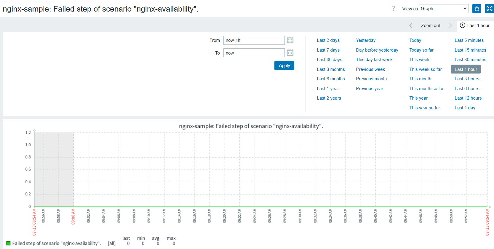

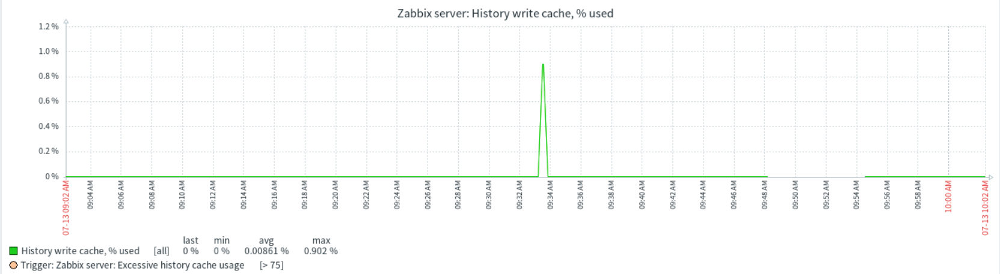

**3단계 — 서버 native HA: failover 실측.** `HANodeName`을 지정하면 다중 서버가 같은 DB를 공유하는 클러스터가 되고(active 1 + standby N, standby는 HA manager 프로세스 1개만 구동), 프론트엔드는 설정에 서버 주소가 정의돼 있지 않아야 DB의 nodes 테이블을 읽어 active 노드를 자동 감지한다. 이에 맞춰 compose를 다섯 곳 배선했다: node1 식별자(`.env` 토글, 빈값=standalone), node2(profile `ha`, BrowserPollers·WebDriverURL 미러), agent2 allow-list(쉼표 2노드 — 없으면 인계 후 agent 아이템이 멎는 함정), 프론트 서버 주소 비움, 그리고 Active 프록시의 노드 나열(세미콜론 — 쉼표는 패시브용이라는 공식 구분). 실측: 클린 종료(`docker stop`)는 3.6초 만에, 크래시(`docker kill`)는 16.6초 만에 standby가 승격했다(failover delay는 기본 60초를 공식 허용 최소값 10초로 조정 — 기본값 그대로면 시연 시간 안에 인계를 관측하기 어렵고, 이 조정 자체가 런타임 명령 `ha_set_failover_delay`의 검증이다)(공식 산식 "delay + 5초"의 기준은 마지막 last-access 갱신 시각이라 kill 기준 최악 봉투는 20초 — 실측은 그 안이다). 크래시의 노드 상태는 stopped가 아니라 unavailable로 남아 두 경로가 구분된다(`images/img_40.png`). 프론트 자동 감지는 양방향으로 확인했고, 클러스터 노드 상태 변경을 Zabbix 자신의 클러스터 트리거가 감지해 알렸다 — 감시 시스템이 자기 failover를 감시한 것이다.

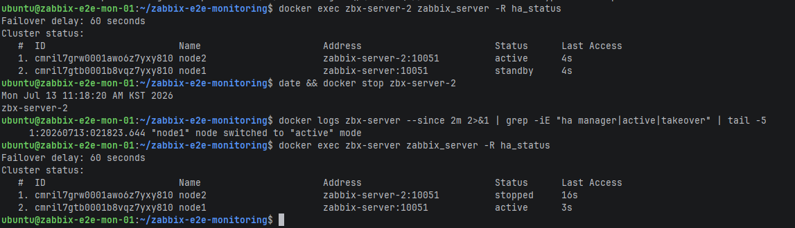

**합체(E4) — 두 평면의 상보성.** active 노드를 kill한 채 프록시로 정속 송신을 계속했다. 프록시 로그에는 다섯 장면이 남았다: 죽은 노드의 DNS 소멸 → standby 접속 시도가 거부됨(standby는 포트를 열지 않는다는 공식 문장의 로그 실증) → 1초 간격 재시도 → 승격 0.6초 뒤 재연결 → 새 active에서 설정 수신. 결과는 180/180 무손실이다(`images/img_46.png`). 제어 평면이 16.6초 죽어 있는 동안 데이터 평면이 그 공백을 덮었다 — 1~3단계가 하나의 문장으로 닫힌다: **직접 수집은 유실 대신 소스를 세우고, 프록시는 그 대기를 대신 지며, HA는 판정·알림의 공백을 초 단위로 줄이고, 둘을 합치면 그 공백조차 무손실이 된다.**

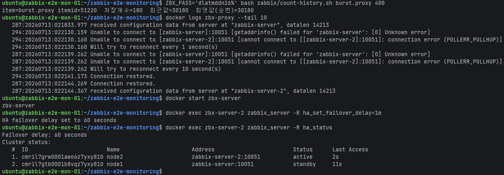

**정직한 한계.** 이 실험은 다음 한계를 숨기지 않는다. 단일 VM이므로 실증한 것은 프로세스 수준 failover이며, 호스트 장애에는 두 노드가 함께 소멸한다 — 다만 검증한 HA 메커니즘(nodes 테이블 선출·자동 감지·다중 노드 나열)은 VM 2대로 분리해도 동일하고 `NodeAddress`만 실 IP로 바뀐다. 서버를 이중화해도 PostgreSQL은 하나를 공유하므로 DB가 남는 단일 장애점이며, 완전 HA는 Postgres 복제(Patroni·repmgr)가 추가로 필요해 명명만 한다 — 흥미롭게도 HA의 split-brain 방지가 DB 접근성을 중재자로 쓰므로(active는 자기 DB 연결이 끊기면 스스로 강등), DB는 이 구조의 급소이자 심장이다. 프록시의 다지점 관측(지역별 POP 선택 — 프로브의 위치가 곧 POP 선택기)은 지역 분산 VM이 필요해 개념 설계로만 남는다. 현재 프록시는 이름만으로 신원을 확인하므로 운영 배치 시 TLS PSK가 필수다. 캐시 축소(128K, syncer 1)는 랩 스케일 실험 통제이지 생산 사이징 권고가 아니다. 모든 실험 서비스는 compose `profiles`로 격리해 기본 기동에 포함되지 않으며, 검증된 E2E 스택과 `midibus-browser-item.js`는 건드리지 않았고, 실험 종료 후 통제 변수를 전부 원복해 스택이 원상임을 확인했다.

---

## 12. 운영 전환 시 고려사항과 한계

이 시스템을 실습 스택에서 실제 운영으로 옮길 때 검토해야 할 사항과 현재 구조의 한계를 정직하게 정리한다.

- **감지 지연** — master Browser Item의 수집 주기는 10분이다. 따라서 장애 발생 시 최악의 경우 약 10분 + 1회 실행시간만큼 감지가 늦어지고, 이 blind window는 SLA 집계에도 영향을 준다(6장의 nodata↔SLA 위험과 같은 축). 주기를 10분으로 둔 이유는 매 실행이 업로드·서버 인코딩(FHD/HD/SD 3종)이라는 실비용을 midibus에 유발하기 때문이다. 감지 속도와 대상 부하가 정면으로 상충하며, 로그인 같은 경량 관문을 더 자주 보려면 4.5절의 파라미터 기반 tier 분리로 주기를 차등화하는 것이 다음 수단이다.
- **감시 대상 계정의 수명 의존성** — midibus는 외부 상용 SaaS가 아니라 KINX가 운영하는 자체 CDN 서비스이므로, 매 주기 반복되는 자동화 트래픽에 대해 외부 이용약관 위반·abuse 차단·외부 쿼터 소진 같은 리스크는 해당하지 않는다. 다만 midibus는 사용에 CDN 운영팀의 검토·승인이 필요하고 무료체험 후 정식 전환되는 계정 구조이므로, 모니터링은 이 계정의 유효 상태(승인·전환 유지, 체험 만료 여부)에 의존한다. 계정 상태가 바뀌면 로그인부터 시나리오 전체가 실패하므로, 이는 abuse 리스크가 아니라 운영상 의존성으로 관리해야 한다. 또한 시나리오는 매 주기 실제 자원(카테고리·미디어·보안키·보조사용자)을 생성·삭제하므로, 4장의 멱등 정리가 계정에 잔여물을 남기지 않는 것이 전제다.
- **egress IP 고정성** — 보안키 재생 검증은 허용 IP를 VM의 egress 공인 IP(`{$VM.EGRESS_IP}`)로 고정한다(트러블슈팅 #5). IXcloud는 공인 IP를 먼저 할당한 뒤 VM에 연결하는 방식이라 이 IP는 VM 재기동·마이그레이션에도 바뀌지 않는 고정 IP다. 따라서 IP 변동으로 인한 보안키 스텝 오탐 위험은 없으며, IP를 의도적으로 재할당하는 경우에만 `{$VM.EGRESS_IP}` 매크로를 갱신하면 된다.
- **자격증명 로테이션** — Secret 매크로(`{$MIDIBUS.PASS}` 등)는 저장소 유출은 막지만 자격증명 교체 절차 자체를 제공하지 않는다. midibus 비밀번호를 바꾼 뒤 매크로 갱신을 누락하면 로그인부터 전 시나리오가 실패한다. 로테이션 주기와 갱신 책임자를 운영 규칙으로 정해야 한다.
- **모니터 자신의 장애 감지** — 서버 프로세스 수준의 죽음은 11장의 native HA가 초 단위 자동 인계로 닫았고, 클러스터 트리거가 failover 자체를 감지·알림하는 것까지 확인했다. 남는 것은 공유 DB와 단일 VM이다. 이 둘이 통째로 죽으면 시스템이 스스로의 죽음을 관측하지 못하며, 이는 내부 관측만으로는 원리적으로 넘을 수 없는 한계다. 자가진단 3층(7.1절) 중 3층(외부 watchdog)이 설계 단계로 남아 있고, 그 도입이 self-heal 실증보다 우선하는 다음 1순위다.
- **Playwright 대비 커버리지** — 실무 인터뷰에 따르면 CDN팀은 E2E 전체를 Playwright(모든 사용자 시나리오 + Allure 리포트 + Slack)로 수행하고, Zabbix는 CPU·메모리 등 인프라 메트릭만 담당한다. E2E를 Zabbix로 이전하는 것도 검토했으나 Zabbix의 시나리오 기능이 충분치 않아 Playwright를 유지했다고 한다. 이는 우리가 겪은 Browser Item의 한계(임의 JS 실행·localStorage 접근 불가, 네트워크 mock·다운로드·다중 컨텍스트 부재, 실행 간 세션 상태 미보존)와 정확히 일치한다. 세션 미보존은 직접 실험으로도 확인했다 — `getCookies`로 HttpOnly 세션쿠키 접근까지는 되지만 실행 간 보존할 곳이 없어 재로그인 생략은 외부 보관을 요구하며, 이것이 곧 Playwright `storageState`가 존재하는 이유임을 체득했다. 실무 Playwright 스펙은 setup·upload_media·manage_category·manage_channel·manage_live_channel·account_check·manage_subuser·player_option 등으로 우리 5스텝보다 커버리지가 훨씬 넓다. 본 프로젝트의 5스텝(로그인·카테고리·미디어·보안키·보조사용자)은 그중 가용성 관점에서 핵심 사용자 여정을 선별한 부분집합이며, 목적이 "테스트 실행"이 아니라 "가용성 모니터링"이기 때문에 이 범위로 한정했다.
- **flaky 성공률** — 집계 스크립트(`zabbix/flaky-rate.sh`)로 산출을 개시했다. 지난 7일간 master Browser Item은 약 797회 실행됐고, 로그인 스텝 기준 성공률은 약 97.9%(실패 17회), 스텝별로는 카테고리·자동배포·미디어 약 97.2%, 보안키·보조사용자 약 95.9%(표본 342회, 두 아이템 신설 이후 구간)로 기록됐다. 다만 이 실패의 대부분은 알림·트리거·SLA 파이프라인을 검증하기 위해 자격증명을 의도적으로 변조한 fault injection에서 발생한 것으로, 자동화 자체의 organic 실패가 아니다. 정상 운영 구간에서는 실패가 거의 관측되지 않았다. 즉 위 성공률은 개발·검증 트래픽이 섞인 값이며, 자동화 고유의 flaky율을 엄밀히 산출하려면 fault injection 이벤트를 태깅해 분모에서 제외하는 계측이 필요하다. 이 계측과 err_class를 이용한 "실장애율 대 flaky율" 분리는 다음 과제로 둔다. 모든 값은 단일 환경의 방향 지표로 읽는다.
- **상관 장애 알림 수렴** — selenium이 다운되면 nodata 트리거, 폴러 헬스 트리거, 컨테이너 트리거가 동시에 발동할 수 있다. 이 상관 장애에서 알림이 하나로 수렴하는지는 현재 미검증이다. 지금까지 검증한 트리거 의존은 login 파손으로 하위 스텝 알림이 억제되는 케이스뿐이며, 인프라 층의 동시 다발 알림 수렴은 추가 설계·검증이 필요하다.

---

## 13. 배운 점과 향후 과제

이 프로젝트에서 얻은 것을 세 가지로 정리한다.

첫째, 모니터링 시스템은 "장애를 감지한다"에서 끝나지 않는다. `last()=0`이 값이 끊기면 영원히 정상이라 답하는 순간, 감시 시스템 자신의 죽음·포화·부하 한계까지가 감시 대상이 된다. 헬스체크 3층과 마무리 실험이 이 인식에서 출발했다.

둘째, 외부 SaaS를 상대로 한 브라우저 자동화는 본질적으로 불안정하며, 그 불안정성은 셀렉터 폴백·스텝 격리·에러 분류·재시도라는 구조로 다스릴 수 있다. 동시에 이 방식의 한계(세션 보존 부재, 임의 JS 불가, 부분 실행 불가)에 정면으로 부딪히며, 실무가 "실행은 Playwright, 모니터링은 Zabbix"로 관심사를 분리하는 이유를 인터뷰로 확인했다. 한계를 숨기지 않고 넘으려 한 궤적 자체가 결과물이다.

셋째, 설계 판단은 실측이 바꾼다. 시나리오 26초와 평시 폴러 duty 4.3%라는 두 숫자가 실행 구조 논쟁의 전제를 뒤집었고, "분리냐 아니냐"가 아니라 "주기 차등과 선택 실행은 다른 문제"라는 요구 분해로 결론이 났다. 문서가 침묵하는 동작은 소스 코드로 확정했다. 마무리 실험에서는 실측이 통설까지 기각했다 — "캐시가 차면 유실된다"는 통설의 실제 거동은 backpressure였고, 이 발견은 측정 방법(시간창 카운트의 착시)까지 바꿨다.

넷째, 이중화는 하나가 아니라 두 평면이다. 데이터 평면(Proxy: 수집을 어디서 모아 안전하게 나르나)과 제어 평면(HA: 판정·알림이 죽지 않나)은 다른 문제를 풀고, 정전 실험에서 "데이터는 살았는데 알림은 침묵했다"는 관찰이 그 경계를 실측으로 보여줬다. 당초의 Kafka 완충안을 폐기한 것도 같은 인식이다 — 네이티브 기능(Proxy)의 재발명 대신 그 기능의 한계(서버 배수 병목, DB SPOF)를 실측으로 확정하는 쪽이 더 많은 것을 가르쳐 줬다.

향후 과제는 셀렉터 폴백 후보를 실 DOM에서 확보해 self-heal 실동작을 검증하는 것, 외부 dead-man switch(층3 watchdog) 도입, Config-as-Code를 host·trigger·action까지 확장하는 것, Kafka egress 통합(Zabbix → 분석계) 설계의 구체화, 공유 PostgreSQL 복제(Patroni·repmgr)와 VM 분리로 남은 SPOF를 해소하는 것, 그리고 실무 트랙인 MySQL → PostgreSQL 마이그레이션 전략(이력 데이터 보존과 무결성 검증 포함)을 정리하는 것이다.

### 13.1 인지한 한계와 고도화 경로의 매핑

각 한계는 실측 과정에서 직접 부딪혀 확인한 것이고, 각 경로는 그 한계를 닫는 구체 수단이다. "무엇이 남았는지 알고, 다음 한 수가 무엇인지 아는 상태"로 프로젝트를 닫는다.

| 인지한 한계 (실측 근거) | 더 고도화한다면 | 규모 |
|---|---|---|
| 단일 VM — 실증한 것은 프로세스 수준 failover뿐, 호스트 장애엔 두 노드가 함께 소멸 (11장) | VM 2대 분리 — 검증한 HA 메커니즘 그대로, `NodeAddress`만 실 IP로 | 설정 수준 |
| 공유 PostgreSQL = 잔존 SPOF, VM을 늘려도 불변 (11장 — DB는 split-brain 중재자이자 급소) | Postgres 스트리밍 복제 + Patroni/repmgr | 별도 트랙 |
| 관측 지점 1개 — 지역별 CDN 편차 미커버, 프로브 위치가 곧 POP 선택기 (11장 프록시 절) | 지역별 프록시 배치 = 다지점 합성 모니터링 (Proxy Group으로 프록시 자체 이중화까지) | VM 증설 |
| 프록시 신원 확인이 이름뿐 — 비암호화 Active 프록시는 구성 데이터 탈취에 노출(공식 경고) | TLS PSK 필수 적용 | 설정 수준 |
| 모니터 자신의 완전한 죽음은 내부에서 관측 불가 (7.1절 층3) | 외부 dead-man switch — self-heal 실증보다 우선 | 소규모 PoC |
| flaky율이 fault injection으로 오염돼 순수 자동화 신뢰도 미산출 (12장) | 검증 이벤트 태깅 → 분모 제외 계측, err_class로 실장애율/flaky율 분리 | 계측 추가 |
| backpressure 판정이 동기 단일 sender 조건에 한정 (11장) | 비동기·병렬 다중 소스 부하 재실험 | 실험 확장 |

---

## 14. 부록 — 산출물 대응표와 저장소 구조

### 14.1 필수 산출물 8종 대응

| # | 산출물 | 위치·근거 |
|---|---|---|
| 1 | 저장소 | 본 GitHub 저장소 |
| 2 | `docker-compose.yml` (단일 기동, `.env` 분리) | 루트, 기본 6서비스(+실험 프로파일 2) + 8080만 노출, 설정 근거 주석 인라인 |
| 3 | nginx 앱 (`/`, `/health`→200+OK, `/status`) | `nginx/conf.d`, `nginx/html` |
| 4 | Web Scenario XML Export (3-Step+) | `zabbix/export/` (nginx-sample + Nginx by HTTP) |
| 5 | Browser Item 설정·결과 | `zabbix/midibus-browser-item.js`, `zabbix/export/`, `images/` 실행 결과 |
| 6 | Trigger·Action + 장애/복구 스크린샷 | 5장, 9장, `zabbix/export/`(트리거 XML 포함), `images/`. Action은 Zabbix가 XML export를 지원하지 않아 스크린샷·설정 서술로 갈음 |
| 7 | README.md | 루트 |
| 8 | 결과보고서 | 본 문서 |

### 14.2 저장소 구조 개요

```
.
├─ docker-compose.yml            # 기본 6서비스 + 실험 프로파일 2 (설정 근거 주석)
├─ .env.example                  # 환경변수 템플릿
├─ nginx/                        # 감시 대상 샘플 앱 (conf.d / html / auth)
├─ zabbix/
│  ├─ midibus-browser-item.js    # Browser Item 5-Step 스크립트
│  ├─ update-item-script.sh      # 스크립트를 Zabbix API로 배포 (config-as-code)
│  ├─ set-webscenario-agent.sh   # Web Scenario User-agent 설정 (요구 4.1)
│  ├─ provision-burst-lab.sh     # 마무리 실험 1단계 프로비저닝
│  ├─ provision-proxy-lab.sh     # 프록시 등록·호스트 전환·티어다운 (11장)
│  ├─ burst-sweep.sh             # 레이트 스윕 발생기 (11장 E3)
│  ├─ count-history.sh           # 저장 개수 조회
│  ├─ get-last-result.sh         # 최근 실행 결과 조회
│  ├─ flaky-rate.sh              # 스텝별 성공률 집계 (12장)
│  └─ export/                    # Web Scenario / Browser Item XML Export
├─ scripts/gen-htpasswd.sh       # /secure Basic Auth 자격 파일 생성
├─ testdata/beach.mp4            # 미디어 업로드 테스트 파일 (5초·1.6MB)
├─ images/                       # 증빙 스크린샷 (장애/복구·대시보드·실험)
├─ TROUBLESHOOTING.md            # 트러블슈팅 10건
├─ README.md
└─ docs/결과보고서.md
```

> 고도화 작업의 상세 로그와 설계 결정 원본은 `private/`(git 미추적)에 보관한다. 본 보고서는 그 핵심을 공개 가능한 범위에서 정리한 것이다.
